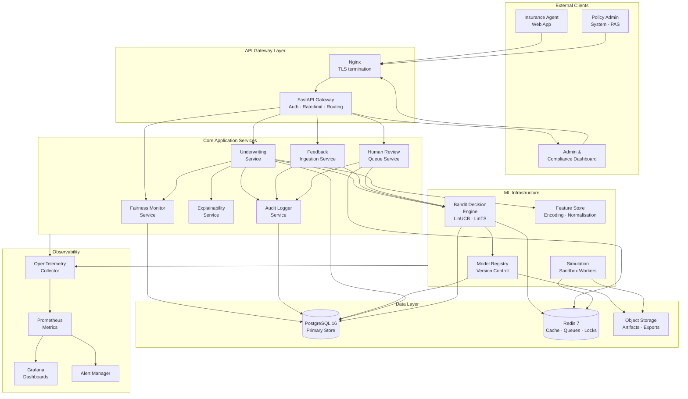
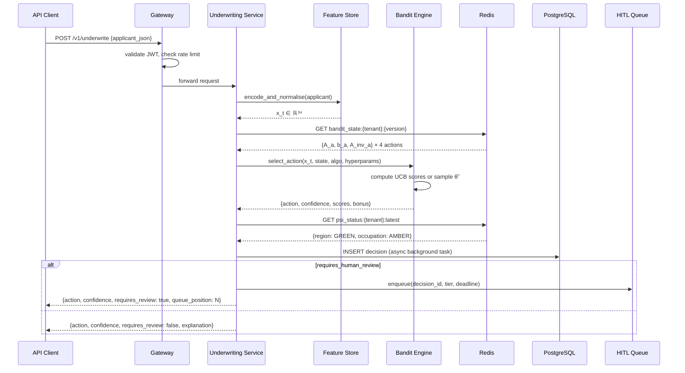
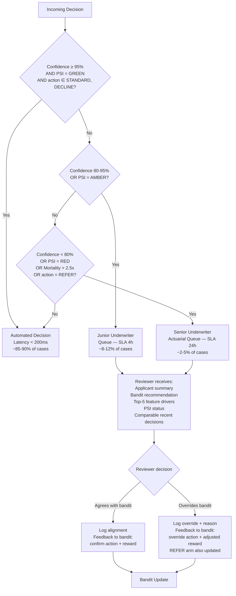
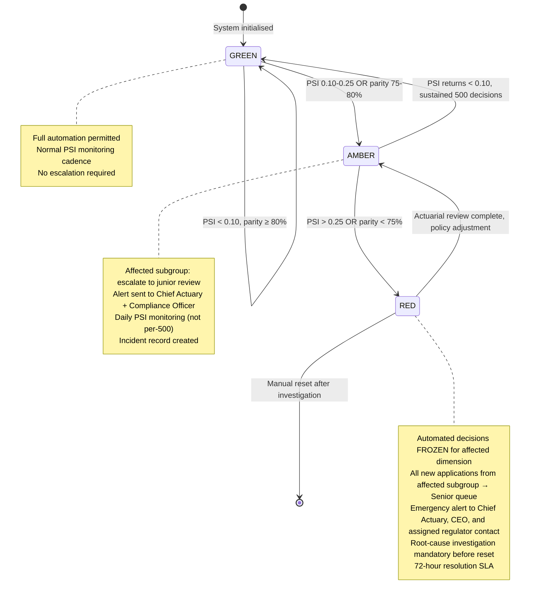

# BanditCore: The Adaptive Underwriting Operating System

**Working product name — branding TBD.**  
Blueprint v1.0 · May 2026 · Confidential — founders, investors, actuarial partners

---

## Table of Contents

1. [Executive Summary](#1-executive-summary)
2. [Product Positioning](#2-product-positioning)
3. [Core Product Modules](#3-core-product-modules)
4. [System Architecture](#4-system-architecture)
5. [Machine Learning System Design](#5-machine-learning-system-design)
6. [Human-in-the-Loop Design](#6-human-in-the-loop-design)
7. [Fairness and Governance](#7-fairness-and-governance)
8. [Data Model and Database Design](#8-data-model-and-database-design)
9. [API Design](#9-api-design)
10. [Frontend and UX](#10-frontend-and-ux)
11. [MVP Specification](#11-mvp-specification)
12. [Go-to-Market Strategy](#12-go-to-market-strategy)
13. [Competitive Advantages](#13-competitive-advantages)
14. [Risks and Failure Modes](#14-risks-and-failure-modes)
15. [Implementation Plan](#15-implementation-plan)
16. [Investor Narrative](#16-investor-narrative)

---

## 1. Executive Summary

### The Startup Thesis

Insurance underwriting in emerging markets is broken by design. Every insurer in Southeast Asia runs the same playbook: train an XGBoost model on historical claims data — usually borrowed from a Western market with fundamentally different disease prevalence, income distributions, and occupational structures — bake it into a deterministic rule engine, and run it for three to five years until someone schedules a retraining sprint. The model never updates from the decisions it makes. It cannot observe that the garment-worker segment in Phnom Penh is actually profitable at STANDARD rates. It has no mechanism to detect when a TB outbreak in highland provinces changes the risk calculus for rural applicants. And when a regulator asks why a civil servant with no pre-existing conditions was declined, the answer is a threshold crossing on a stale mortality multiplier.

**BanditCore replaces this static rule engine with an adaptive decision intelligence platform.** The core is a contextual bandit — a lightweight form of reinforcement learning that makes one underwriting decision at a time, observes the outcome, and immediately updates its model. Every policy issued, declined, or reviewed makes the next decision marginally more accurate. Over twelve months, an insurer running BanditCore accumulates a posterior distribution over underwriting parameters that is calibrated to their specific portfolio, their specific applicant pool, and their specific claims experience. That posterior is the insurer's institutional knowledge, encoded in a 34×34 precision matrix that no competitor can copy.

### The Market Pain

| Pain | Impact | Root Cause |
|------|--------|------------|
| Static rules misclassify profitable low-risk segments | 25%+ reward loss vs adaptive optimal | No online learning |
| Models go stale between retraining cycles | Decision quality degrades over months | Batch-only retraining |
| Manual underwriting costs $35–80 per complex case | Micro-premium products are uneconomic | No smart triage |
| Fairness violations expose insurers to regulatory censure | Fines, license risk, reputational damage | No real-time demographic monitoring |
| Black-box ML creates regulator friction | Slow product approvals, audit failures | No interpretability layer |
| Cold-start when entering new segments | 500–1,000 poor decisions before model stabilises | No warm-start protocol |

### Why Adaptive Systems Win

The thesis proof is unambiguous: across 20 independent random seeds and 5,000 simulated underwriting decisions per seed, a linear contextual bandit (LinUCB, α = 1.0) accumulates **+25.2% more cumulative reward** than a best-practice XGBoost rule engine (p < 0.001, Cohen's d = 2.98 — a large effect). The mechanism is not exotic: it is simply online ridge regression. The bandit updates its per-action coefficient vector $\hat{\theta}_a$ after every decision. The XGBoost baseline does not. The performance gap is causal, not correlational, because the ablation (EXP-011) confirms: even a greedy variant of LinUCB with zero exploration bonus outperforms Static XGB by +$18,969 (p < 0.001, d = 3.01). The exploration apparatus is optional. The online updating is not. Insurers that adopt adaptive underwriting are not getting a better ML model — they are switching from a static photograph of their portfolio to a live feed.

### Why Now

Three forces converge in 2026 that make this product viable today but would have failed in 2020:

1. **Regulatory openness.** ASEAN insurance regulators (OIC Thailand, OJK Indonesia, IRC Cambodia) are actively soliciting sandbox proposals for AI-assisted underwriting. The window for first-mover regulatory engagement is 18–24 months.
2. **Data infrastructure maturity.** Mobile-first KYC, biometric identity, and digital claims reporting now exist in Cambodia, Vietnam, Thailand, and the Philippines. The data pipes that feed a bandit feature vector are real.
3. **Algorithm commoditisation enabling interpretability.** The commodity choice in 2026 is not the ML algorithm — it is the governance layer. Linear bandits with inspectable coefficient vectors are the only class of ML model that a Cambodian or Thai actuary can explain to a regulator without a data science PhD. Neural alternatives cannot compete on this axis.

### Long-Term Vision

BanditCore begins as an adaptive underwriting engine for health insurance in Cambodia and ASEAN. The long-term platform is a **decision intelligence operating system for all financial risk assessment in emerging markets**: credit scoring, fraud detection, life insurance underwriting, micro-lending, claims triage, and dynamic pricing — all running on the same online-learning infrastructure, all feeding the same institutional knowledge graph, all governed by the same PSI fairness layer. The switching cost for an insurer two years into BanditCore is not the price of a competitor's product. It is the cost of abandoning a posterior trained on 500,000 of their own decisions.

---

## 2. Product Positioning

### Ideal Customer Profile

The beachhead customer is a **regional health insurer in ASEAN** with the following profile:

| Attribute | Description |
|-----------|-------------|
| **Geography** | Cambodia, Vietnam, Thailand, Philippines (Phase 1) |
| **Policy count** | 50,000–500,000 active health policies |
| **Tech maturity** | Has a core policy admin system (PAS) but no in-house ML team |
| **Pain trigger** | Recent regulatory audit, retraining cost pressure, or competitor introducing AI underwriting |
| **Data readiness** | 2+ years of digitised application and claims data |
| **Decision volume** | 500–5,000 new underwriting decisions per month |
| **Budget** | $3,000–15,000/month SaaS + integration budget |

The customer does **not** need to understand contextual bandits. They need to understand two numbers: their current approval-to-loss ratio, and how much it improves in a 90-day shadow-mode pilot.

### Buyer Personas

**Persona 1 — The Chief Actuary (Economic Buyer)**
- Cares about: loss ratio improvement, reserve adequacy, regulatory compliance, model documentation
- Fear: a fairness incident that lands in the regulator's office
- Selling motion: show the PSI dashboard and EEOC parity results before you show them the reward lift
- Quote to use: "Your current model misclassifies an estimated 18–22% of borderline cases. We can show you which ones in 48 hours using shadow mode."

**Persona 2 — The CTO / Head of Digital (Technical Evaluator)**
- Cares about: integration complexity, vendor lock-in, latency, API quality, data residency
- Fear: a 12-month integration project that doesn't deliver
- Selling motion: 3-hour API integration demo, live on their PAS sandbox, sub-200ms response
- Quote to use: "It's a REST endpoint. You send us an applicant JSON; we return a decision, a confidence score, a PSI status, and a feature-importance breakdown. Your PAS treats us like any other microservice."

**Persona 3 — The Compliance Officer (Political Blocker or Champion)**
- Cares about: audit trails, regulator-ready reports, explainability, demographic parity documentation
- Fear: regulatory enforcement action for algorithmic discrimination
- Selling motion: lead with the immutable audit log, the model card generator, and the one-click regulator export
- Quote to use: "Every decision we make is logged with the exact feature vector, the action, the confidence score, the PSI status at the time, and the human reviewer's name if it was escalated. That log is cryptographically tamper-evident. If a regulator asks why applicant #48,372 was declined, you can answer in 30 seconds."

### Wedge Strategy

**The wedge is Shadow Mode.** An insurer can plug in BanditCore with zero operational risk: their existing rule engine continues to make binding decisions; BanditCore runs in parallel, observing every application and every outcome, updating its model without ever controlling a live decision. After 1,000–2,000 applications, the bandit crosses the cold-start threshold and begins producing superior recommendations. The insurer can see exactly how many decisions BanditCore's recommendations would have changed, and what the profit impact would have been. This converts a trust problem into a data problem, and data problems are solvable in 60–90 days.

**The wedge expands by module.** An insurer starts with shadow mode (no commitment), moves to assisted underwriting (human confirms BanditCore's recommendation), then to automated underwriting with escalation (90%+ of decisions auto-approved). Each phase deepens integration, increases switching cost, and expands the contract value.

### Beachhead → Enterprise Expansion Map

```
Phase 1 (0–18 months):   Cambodia health insurance
                          → 2–3 pilot insurers
                          → prove +20% reward lift in production
                          → establish regulatory sandbox relationship

Phase 2 (18–36 months):  ASEAN health insurance
                          → Vietnam, Thailand, Philippines
                          → multi-country tenancy
                          → regulator-approved model card template

Phase 3 (36–60 months):  ASEAN multi-product
                          → life insurance underwriting
                          → micro-lending credit scoring
                          → fraud triage

Phase 4 (60+ months):    Global emerging markets
                          → Sub-Saharan Africa
                          → South Asia
                          → LATAM
                          → white-label OEM for reinsurers
```

### Competitive Comparison

| Capability | BanditCore | Majesco | EIS Suite | Duck Creek | In-House ML |
|------------|:----------:|:-------:|:---------:|:----------:|:-----------:|
| Online learning (updates per decision) | ✅ | ❌ | ❌ | ❌ | ⚠️ rare |
| Interpretable coefficients (regulator-ready) | ✅ | ❌ | ❌ | ❌ | ❌ typically |
| Real-time PSI fairness guardrails | ✅ | ❌ | ❌ | ❌ | ❌ |
| Human-in-the-loop triage (built-in) | ✅ | ⚠️ manual | ⚠️ manual | ⚠️ manual | ❌ |
| Shadow mode deployment | ✅ | ❌ | ❌ | ❌ | ❌ |
| Warm-start from historical data | ✅ | N/A | N/A | N/A | ⚠️ |
| Sub-200ms decision latency | ✅ | ⚠️ | ✅ | ⚠️ | ✅ |
| Emerging-market calibration | ✅ Cambodia | ❌ | ❌ | ❌ | ❌ |
| Immutable audit log + regulator export | ✅ | ⚠️ | ⚠️ | ⚠️ | ❌ |
| No-GPU deployment | ✅ | ✅ | ✅ | ✅ | ❌ typically |
| Drift detection (sliding PSI) | ✅ | ❌ | ❌ | ❌ | ❌ |

The column that matters most to regulators: **interpretable coefficients**. This is where incumbents have no answer. A Majesco installation running a neural network inside a black-box actuarial model cannot produce a per-feature coefficient vector on demand. BanditCore can, in every single response.

---

## 3. Core Product Modules

### Module 1 — Real-Time Underwriting Engine

**Purpose:** The synchronous request-response core of the platform. Receives an applicant context, orchestrates the bandit decision, checks fairness guardrails, and returns a structured underwriting recommendation within 200ms.

**Primary users:** Insurance agents (via PAS integration), policy admin systems (via API), underwriting managers (via dashboard)

**Inputs:**
- Raw applicant JSON (demographic, health, financial, occupational features)
- Tenant configuration (active model version, confidence thresholds, PSI reference distribution)
- Request options (`shadow_mode`, `return_explanation`, `force_human_review`)

**Outputs:**
- Recommended action: `STANDARD | RATED | DECLINE | REFER`
- Confidence score (0.0–1.0, derived from posterior variance)
- Per-action expected reward breakdown
- PSI status snapshot at time of decision
- Feature importance vector (top-5 contributing features)
- `requires_human_review` flag with routing tier (`junior | senior`)
- Decision UUID for downstream tracking

**Architecture:** Stateless FastAPI handler. Reads bandit state from Redis (hot path, < 5ms) or PostgreSQL (cold path, < 30ms). Writes decision record asynchronously to PostgreSQL via a background task. PSI check runs against a per-tenant cached reference distribution stored in Redis.

**Critical operational concern:** Bandit state (the $A_a$ and $b_a$ matrices) must be read atomically. If two concurrent decisions race on a read-modify-write cycle, the bandit can corrupt its precision matrix. Mitigation: Redis sorted-set lock per tenant per action, with a 50ms TTL and optimistic retry. The update pipeline is asynchronous and does not block the decision response.

**Latency budget:**
| Step | Budget |
|------|--------|
| Feature encoding | < 10ms |
| Bandit state read (Redis) | < 5ms |
| UCB / Thompson sampling | < 2ms |
| PSI status lookup | < 3ms |
| Decision write (async) | non-blocking |
| **Total P99** | **< 200ms** |

---

### Module 2 — Bandit Decision Engine

**Purpose:** The mathematical core. Implements LinUCB and LinTS as stateful, per-tenant, per-action estimators. Exposes a uniform interface regardless of algorithm choice. Handles warm-starting, state serialisation, and policy versioning.

**Primary users:** Internal (called by Underwriting Engine), MLOps team (for version management)

**Inputs:**
- Encoded feature vector $x_t \in \mathbb{R}^d$ (d = 34 default)
- Per-action state: $A_a \in \mathbb{R}^{d \times d}$, $b_a \in \mathbb{R}^d$, $A_a^{-1} \in \mathbb{R}^{d \times d}$ (cached)
- Algorithm selection (`linucb` | `lints`)
- Hyperparameters (α for LinUCB, v² for LinTS)

**Outputs:**
- Selected action $a_t$
- Per-action UCB scores or sampled reward estimates
- Confidence metric (inverse posterior variance for selected arm)
- Exploration bonus magnitude (diagnostic, logged but not returned to API client)

**State management:** Each tenant maintains 4 independent ridge estimators (one per action: STANDARD, RATED, DECLINE, REFER). State is serialised as flat `DOUBLE PRECISION[]` arrays in PostgreSQL and cached as binary blobs in Redis with a 5-minute TTL. On write, the cache is invalidated and the DB is the source of truth. State snapshots are versioned: each `model_versions` record points to the bandit state at activation time, enabling rollback to any prior checkpoint.

**Warm-start protocol:** When a tenant activates a new model, the pre-population endpoint accepts a batch of historical decisions. Each historical record $(x_s, a_s, r_s)$ is replayed as:
$$A_{a_s} \leftarrow A_{a_s} + x_s x_s^\top, \qquad b_{a_s} \leftarrow b_{a_s} + r_s x_s$$
The inverse $A_a^{-1}$ is computed once at the end of the warm-start batch rather than via Sherman-Morrison for each historical record, since the historical records are processed offline without latency constraints.

---

### Module 3 — Human Review Queue

**Purpose:** A prioritised task queue for cases that the Bandit Decision Engine has flagged as uncertain, PSI-anomalous, or explicitly tagged as REFER. Routes to the correct reviewer tier with SLA enforcement.

**Primary users:** Junior underwriters, senior underwriters, actuarial team leads

**Inputs:**
- Decisions with `requires_human_review = true`
- Priority signals: confidence score, PSI status, applicant mortality risk band, days since application
- Reviewer role assignments (per-tenant RBAC configuration)

**Outputs:**
- Resolved final action (may differ from bandit's initial recommendation)
- Override reason (structured taxonomy + free text)
- Alignment signal (did reviewer agree with bandit?)
- Resolved decision fed back to Feedback Learning Loop

**Queue architecture:** Redis Streams with consumer groups, one stream per tenant. Three consumer groups: `junior`, `senior`, `actuarial`. Items move between groups via escalation events. Dead-letter queue for items exceeding SLA without resolution. SLA timers tracked via Redis sorted sets (score = deadline timestamp).

**SLA policy:**
| Trigger | Tier | SLA |
|---------|------|-----|
| Confidence 80–95%, PSI GREEN | Junior | 4 hours |
| Confidence < 80%, PSI AMBER | Senior | 8 hours |
| PSI RED, action = REFER, mortality > 2.5× | Actuarial | 24 hours |
| Any RED PSI + volume spike | Actuarial + escalation | 2 hours |

**Operational concern:** Queue depth is a leading indicator of model degradation. If queue depth spikes > 5% of daily decision volume, this means the bandit's confidence is collapsing — usually because of distribution shift. This event triggers an automatic PSI recompute and an alert to the tenant's assigned account manager.

---

### Module 4 — Fairness Monitoring System

**Purpose:** Continuously evaluates the approved portfolio's demographic composition against the reference applicant distribution. Computes PSI and approval-rate parity on a rolling basis and enforces the GREEN/AMBER/RED operational policy.

**Primary users:** Chief Actuaries, Compliance Officers, Regulators (via export)

**Inputs:**
- All decisions made in the current sliding window (configurable, default 500)
- Reference distribution: per-tenant demographic proportions from the historical applicant pool (stored at tenant onboarding)
- Monitored dimensions: region, occupation, age band, wealth quintile (expandable)

**Outputs:**
- Per-dimension PSI value with traffic-light status
- EEOC 4/5 parity ratio per dimension
- Historical PSI time series (last 90 days)
- Alert events (AMBER threshold crossing, RED threshold crossing)
- Fairness incident records when RED is breached

**PSI formula:**
$$\text{PSI} = \sum_{i=1}^{B} (A_i - E_i) \times \ln\!\left(\frac{A_i + \epsilon}{E_i + \epsilon}\right), \quad \epsilon = 10^{-8}$$

Traffic-light classification:
| PSI | Status | Action |
|-----|--------|--------|
| < 0.10 | GREEN | Normal operation |
| 0.10–0.25 | AMBER | Alert + increased monitoring; auto-escalate affected subgroup |
| > 0.25 | RED | Freeze automated decisions for affected dimension; mandatory actuarial review |

**EEOC 4/5 parity enforcement:**
$$\text{ParityRatio}(g) = \frac{\text{ApprovalRate}(g)}{\max_{g'} \text{ApprovalRate}(g')} \geq 0.80 \quad \forall g$$

Computed on the converged phase (last 2,000 decisions), not on all-time to avoid contaminating converged estimates with early exploration noise.

---

### Module 5 — Drift Detection System

**Purpose:** Distinguishes between two types of drift that require different responses: (a) **portfolio drift** — the approved applicant pool is drifting away from the reference population (detected via PSI on outputs), and (b) **distributional drift** — the incoming applicant population itself is changing (detected via PSI on inputs). The distinction matters: portfolio drift can be caused by the bandit's own decisions; input drift is an environmental signal that may require model re-weighting.

**Inputs:**
- Incoming applicant feature distributions (real-time, sampled every 500 applicants)
- Reference applicant distribution (historical baseline)
- Approved portfolio distribution (rolling, updated after each decision)

**Outputs:**
- Input PSI (is the applicant pool changing?) — separate from output PSI
- Drift severity score (0–1 composite, weighting input and output PSI)
- Drift type classification: `portfolio | environmental | combined`
- Recommended action: `monitor | review_coefficients | warm_restart`

**Discounted LinUCB recommendation:** For detected environmental drift, the system recommends switching from standard LinUCB to a Discounted LinUCB variant:
$$A_t \leftarrow \lambda A_{t-1} + x_t x_t^\top, \quad b_t \leftarrow \lambda b_{t-1} + r_t x_t$$
where $\lambda \in (0,1)$ is a forgetting factor. $\lambda = 0.95$ discounts observations from 100 rounds ago by roughly 0.5×. The recommended $\lambda$ value is computed from the magnitude of the detected PSI shift: larger shift → smaller $\lambda$ (faster forgetting).

---

### Module 6 — Audit and Governance Layer

**Purpose:** Immutable, append-only event log for every consequential action in the system. Provides the regulator-facing audit trail, the internal incident investigation substrate, and the forensic replay capability.

**Primary users:** Compliance Officers, Regulators, Internal audit teams

**What is logged:** Every event that affects a decision, a model state, or a human action:
- Decision created (full context vector snapshot)
- Decision resolved (final action + any human override)
- Model version activated or rolled back
- PSI threshold crossed
- Human reviewer assigned, reassigned, or escalated
- Reward received (immediate or delayed)
- Parameter update applied to bandit state
- Admin configuration changed
- API key created or revoked

**Tamper-evidence:** Each audit log row includes a `chain_hash`: SHA-256 of (previous row's `chain_hash` + current row's payload). Any tampering with a historical row invalidates all subsequent hashes, making tampering detectable without a blockchain. The chain is verified on demand by the compliance dashboard.

**Regulator export:** One-click export of all decisions for a specified date range and applicant subgroup, in CSV format, including: decision UUID, timestamp, applicant anonymised ID, action, confidence, PSI status, reviewer name (if applicable), final action, reward (if available), and the top-5 feature contributions to the decision.

---

### Module 7 — Simulation Sandbox

**Purpose:** Allows actuaries and product teams to replay historical decisions under counterfactual configurations — different algorithms, different hyperparameters, different reward parameters — without touching the production model. Essential for evaluating configuration changes before deployment.

**Primary users:** Actuarial teams, product managers, MLOps engineers

**Inputs:**
- Historical decision dataset (tenant-scoped, anonymised)
- Simulation configuration: algorithm, α/v²/ε, reward parameters (premium multipliers, adverse-selection factor, elasticity slope)
- Horizon: number of rounds to simulate

**Outputs:**
- Cumulative reward curve vs production baseline
- Regret curve
- Final action distribution
- PSI trajectory across simulation
- Statistical comparison (mean ± std, 95% CI, Wilcoxon p-value vs baseline)
- Pass/fail against configurable criteria (e.g., "must outperform current production model at p < 0.05")

**Architecture:** Stateless Python workers (Celery) pulled from a simulation job queue. Each job runs in an isolated container with a copy of the historical dataset. Results stored in object storage (S3) and surfaced via a polling API. Typical simulation: 5,000 rounds, 10 seeds, < 60 seconds on 2 vCPU.

---

### Module 8 — Policy Configuration Engine

**Purpose:** Provides tenant-specific configuration of the reward function, confidence thresholds, PSI reference distribution, escalation routing, feature schema, and operational policies. Decouples the algorithm from the business rules.

**Primary users:** Chief Actuaries (reward parameters), CTOs (API configuration), Compliance Officers (fairness thresholds)

**Key configurables:**

| Parameter | Default | Tenant Override |
|-----------|---------|-----------------|
| Algorithm | `linucb` | `lints`, `epsilon_greedy` |
| α (LinUCB exploration) | 1.0 | 0.1–5.0 |
| v² (LinTS posterior variance) | 1.0 | 0.1–5.0 |
| ε (Epsilon-Greedy) | 0.15 | 0.01–0.50 |
| Base premium multiplier | 200 × m | Tenant table |
| Processing cost | $25 | $10–$100 |
| Walk cost | $20 | $10–$80 |
| Adverse-selection threshold | m > 2.0 | m > 1.5–3.0 |
| Adverse-selection factor | 1.35 | 1.0–2.0 |
| Customer elasticity slope | 3.5 | 1.0–6.0 |
| Auto-approval confidence threshold | 95% | 80–99% |
| Junior review threshold | 80% | 60–95% |
| PSI AMBER threshold | 0.10 | 0.05–0.15 |
| PSI RED threshold | 0.25 | 0.15–0.35 |
| EEOC parity floor | 80% | 70–90% |
| Feature schema | 34-dim Cambodia | Tenant-specific |

**Governance:** Configuration changes require two-factor approval (proposer + approver from a separate role). Every change is logged to the audit trail with before/after values. A simulation sandbox run is mandatory before activating changes that affect reward parameters.

---

### Module 9 — Explainability Dashboard

**Purpose:** Surfaces per-action coefficient vectors and per-decision feature importance to underwriters, actuaries, and regulators. The interpretability that neural alternatives cannot provide.

**Primary users:** Underwriters (per-decision), Actuaries (portfolio), Regulators (audit)

**Per-decision explanation:**
The per-action expected reward is linear in the feature vector:
$$\hat{r}_a = \hat{\theta}_a^\top x_t = \sum_{j=1}^{d} \hat{\theta}_{a,j} \cdot x_{t,j}$$

The feature importance for action $a$ on applicant $t$ is simply the signed product $\hat{\theta}_{a,j} \cdot x_{t,j}$ for each feature $j$. The top-5 contributors explain the majority of the decision for well-conditioned problems.

**Example explanation output (returned in API response):**
```json
{
  "action": "RATED",
  "expected_reward": 31.40,
  "top_features": [
    {"feature": "has_tb", "direction": "negative", "contribution": -18.20},
    {"feature": "age_normalised", "direction": "positive", "contribution": +9.10},
    {"feature": "occupation_garment_worker", "direction": "negative", "contribution": -6.80},
    {"feature": "monthly_income_usd", "direction": "positive", "contribution": +5.40},
    {"feature": "is_smoking", "direction": "negative", "contribution": -4.10}
  ],
  "plain_english": "Rated because TB flag and garment-worker occupation increase expected claims, partially offset by income stability and age profile."
}
```

The `plain_english` field is templated from the top features — not LLM-generated — to ensure determinism for regulator review.

---

### Module 10 — Shadow Mode Deployment System

**Purpose:** Enables a new tenant to onboard BanditCore with zero operational risk. The platform observes every application and every outcome, updates its model, and generates a shadow recommendation log — but the binding decision remains with the incumbent system.

**Primary users:** New tenants during onboarding, existing tenants testing configuration changes

**How it works:**
1. Tenant sends every application to BanditCore via the standard underwriting endpoint with `shadow_mode: true`
2. BanditCore makes a decision and returns it, but the `binding` field is set to `false`
3. The tenant's incumbent system makes the binding decision
4. The tenant sends the incumbent system's outcome (action + reward) to BanditCore's feedback endpoint
5. BanditCore updates its bandit state using the incumbent system's reward as the proxy reward
6. After 1,000–2,000 shadow applications, BanditCore's recommendation divergence report is generated: "On 847 of the last 1,000 applications we agreed with your system. On the 153 disagreements, our recommended action would have produced an estimated $X more in reward."

**Cold-start crossover:** Based on EXP-010, the bandit's cumulative reward surpasses a freshly-trained XGBoost baseline between T = 1,000 and T = 2,000 applications on Cambodia-scale data (34 features, 7 occupations, 8 regions). The Shadow Mode report includes the crossover signal: a green banner that says "BanditCore is now performing above your current model in shadow simulation. Recommend transitioning to Assisted Mode."

---

### Module 11 — Feedback Learning Loop

**Purpose:** Ingests realised rewards from all sources (immediate API feedback, delayed claims data, human reviewer overrides) and propagates them into the online bandit update pipeline.

**Primary users:** Internal system (automated), MLOps engineers (monitoring)

**Reward sources and handling:**

| Source | Typical delay | Handling |
|--------|--------------|----------|
| Customer accept/reject | < 1 hour | Immediate via `/v1/feedback` endpoint |
| First claim filed | 1–90 days | Deferred reward queue with decision UUID linkage |
| Human reviewer override | Minutes | Override endpoint; both REFER arm and override arm are updated |
| Synthetic proxy (shadow mode) | Immediate | Incumbent system outcome used as reward |
| Lapse (no claim filed after 12 months) | 12 months | Partial reward signal: premium received, zero claim |

**Delayed reward challenge:** Health insurance claims emerge 6–24 months after policy issuance. The system handles this via a deferred reward queue: when a policy is issued, a deferred reward record is created with the decision UUID and an expected resolution date. When a claim arrives, the feedback endpoint matches on decision UUID and triggers a late-arriving bandit update. The update is weighted by a discount factor $\gamma^{\Delta t}$ where $\Delta t$ is the delay in months and $\gamma = 0.95$, implementing a soft preference for recent feedback without discarding delayed signals.

---

### Module 12 — Model Registry and Version Control

**Purpose:** Immutable versioning of every bandit state snapshot, including the $A_a$ and $b_a$ matrices for all four actions, the feature schema, the hyperparameter configuration, and the performance metrics at the time of versioning.

**Version lifecycle:** `shadow → assisted → active → retired`

Every promotion between stages requires: (a) passing a simulation against historical data, (b) two-approver sign-off, and (c) an audit log entry. Rollback to any prior version is a one-click operation with an automatic shadow-mode validation step before re-activation. Rollback reason is mandatory and logged.

---

## 4. System Architecture

### Technology Stack

| Layer | Choice | Justification |
|-------|--------|---------------|
| **Frontend** | Next.js 14, TypeScript, TailwindCSS, shadcn/ui | SSR for fast dashboard load, strong typing, accessible component library |
| **API gateway** | FastAPI (Python 3.11) + Nginx | Native async, Pydantic validation, sub-10ms routing overhead |
| **ML service** | FastAPI service, NumPy 2.0, scikit-learn 1.5 | Co-located with bandit state; Python keeps ML and serving in one process |
| **Primary database** | PostgreSQL 16 | ACID compliance for audit trail, JSONB for feature vectors, row-level tenant isolation |
| **Cache + queues** | Redis 7 (Cluster mode) | Sub-millisecond bandit state reads, Streams for HITL queue, Pub/Sub for events |
| **Object storage** | AWS S3 / Cloudflare R2 | Model artifacts, simulation output, bulk audit exports |
| **Task queue** | Celery + Redis broker | Simulation jobs, batch PSI recomputes, delayed reward processing |
| **Observability** | OpenTelemetry + Grafana + Prometheus | Latency histograms, queue depth, PSI time series, regret tracking |
| **Auth** | Supabase Auth (JWT) + RBAC middleware | Fast implementation, SOC 2 compliant, supports OAuth2 for enterprise SSO |
| **Deployment** | Docker + Kubernetes (EKS/GKE) | Horizontal pod autoscaling on decision volume; tenant-isolated namespaces |
| **CI/CD** | GitHub Actions + ArgoCD | GitOps deployment, automated experiment regression on every merge |

### High-Level System Architecture



### ML Decision Pipeline (Sequence)



### Feedback and Online Learning Pipeline

```mermaid
flowchart LR
    A[Decision Logged\nid · x_t · a_t] --> B{Reward Source}
    B -->|Immediate\ncustomer accept/reject| C[/v1/feedback\nimmediate]
    B -->|Delayed\nclaim filed ≤90 days| D[Deferred Queue\nmatched by decision_id]
    B -->|Human override\nHITL resolved| E[/v1/feedback\nhuman_override]
    B -->|Lapse\n12-month no-claim| F[Batch job\nnightly]

    C --> G[Reward Normaliser\ndiscount · validate]
    D --> G
    E --> G
    F --> G

    G --> H[Online Ridge Update\nA_a ← A_a + x_t xᵀ_t\nb_a ← b_a + r_t x_t]
    H --> I[Sherman-Morrison\nO-d² inverse update]
    I --> J[Redis Cache Invalidate\nwrite new state to PG]
    J --> K{Round count\nmod 500 = 0?}
    K -->|Yes| L[PSI Recompute\nall monitored dimensions]
    K -->|No| M[Continue]
    L --> N{PSI Status?}
    N -->|GREEN| M
    N -->|AMBER| O[Alert · Escalate\naffected subgroup]
    N -->|RED| P[Freeze Automation\nActuarial escalation]
```

### Multi-Tenant Isolation Model

```mermaid
graph TB
    subgraph TenantA["Tenant A — Cambodia Health Insurer"]
        A1[LinUCB α=1.0\n34-feature schema\nCDHS reference dist.]
        A2[A_a,b_a matrices × 4 actions\nversioned snapshot]
        A3[Reward config:\nbase_premium=200m\nadv_sel=1.35]
    end

    subgraph TenantB["Tenant B — Vietnam Health Insurer (V2+)"]
        B1[LinTS v²=0.8\n41-feature schema\nVHLS reference dist.]
        B2[A_a,b_a matrices × 4 actions\nversioned snapshot]
        B3[Reward config:\nbase_premium=180m\nadv_sel=1.20]
    end

    subgraph Shared["Shared Infrastructure — Row-Level Tenant Isolation"]
        C1[PostgreSQL 16\ntenant_id FK on every table\nRow-level security policies]
        C2[Redis 7\nNamespaced keys:\nbandit:{tenant_id}:{version_id}:{action}]
        C3[API Gateway\nJWT claims include tenant_id\nAll queries scoped to tenant]
        C4[Model Registry\nPer-tenant version chains\nCross-tenant leakage impossible]
    end

    A1 <--> C1
    A1 <--> C2
    B1 <--> C1
    B1 <--> C2
    C3 --> A1
    C3 --> B1
    A1 <--> C4
    B1 <--> C4
```

---

## 5. Machine Learning System Design

### 5.1 Why Linear Bandits, Not Deep RL

The choice of linear contextual bandits over deep reinforcement learning, neural bandits, or full MDPs is deliberate and defensible on four axes:

| Property | Linear Bandit | Deep RL / Neural Bandit | Full MDP |
|----------|:-------------:|:-----------------------:|:--------:|
| Convergence time (data-efficient) | Fast (O(d²) updates) | Slow (millions of samples) | Very slow |
| Interpretability (regulator audit) | ✅ explicit θ_a vectors | ❌ black box | ❌ black box |
| No-GPU deployment | ✅ CPU-only | ❌ typically | ❌ typically |
| Theoretical regret bound | ✅ O(d√T) proven | ⚠️ empirical only | ⚠️ problem-specific |
| Markov assumption required | ❌ stateless OK | ⚠️ sometimes | ✅ required |
| Hyperparameter sensitivity | Low (α or v²) | High (lr, arch, γ, ...) | Very high |
| Rollback safety | ✅ matrix arithmetic | ❌ weight reversion non-trivial | ❌ |

The thesis ablation (EXP-011) provides an additional empirical justification: the exploration bonus adds no statistically significant gain on the Cambodia 34-feature problem (Greedy α=0 vs full LinUCB: p = 0.58, d = 0.13). This suggests the 34-dimensional feature space has sufficient covariate diversity that an exploration-free linear estimator is near-optimal — consistent with Bastani, Bayati & Khosravi (2021). In this regime, the algorithm complexity budget is better spent on governance and interpretability than on exploration sophistication.

For future expansion to richer feature spaces (telematics, claims history, mobile-wallet signals), the architecture supports plugging in a neural embedding layer upstream of the linear bandit — a hybrid neural-linear approach that preserves the interpretable linear head while allowing non-linear feature extraction.

### 5.2 LinUCB — Full Specification

**Algorithm:** Frequentist ridge regression with upper confidence bound exploration.

**State per action:** $A_a \in \mathbb{R}^{d \times d}$ (precision matrix, initialised to $I_d$), $b_a \in \mathbb{R}^d$ (response vector, initialised to $\mathbf{0}$), $A_a^{-1} \in \mathbb{R}^{d \times d}$ (cached inverse via Sherman-Morrison).

**Parameter estimate:**
$$\hat{\theta}_a = A_a^{-1} b_a$$

**Action selection (UCB policy):**
$$a_t = \arg\max_{a \in \mathcal{A}} \left( \hat{\theta}_a^\top x_t + \alpha \sqrt{x_t^\top A_a^{-1} x_t} \right)$$

The second term $\alpha \sqrt{x_t^\top A_a^{-1} x_t}$ is the UCB bonus: the standard deviation of the posterior predictive distribution scaled by $\alpha$. It is large when $x_t$ lies in a direction that has been rarely observed (the action's precision matrix has not been well-conditioned in that direction), inducing exploration of undersampled applicant profiles.

**Update on observing $(x_t, a_t, r_t)$:**
$$A_{a_t} \leftarrow A_{a_t} + x_t x_t^\top$$
$$b_{a_t} \leftarrow b_{a_t} + r_t x_t$$

**Sherman-Morrison inverse maintenance ($O(d^2)$ per update):**
$$A_a^{-1} \leftarrow A_a^{-1} - \frac{(A_a^{-1} x_t)(x_t^\top A_a^{-1})}{1 + x_t^\top A_a^{-1} x_t}$$

This avoids the $O(d^3)$ matrix inversion at each round. With $d = 34$, the update requires approximately $34^2 = 1,156$ floating-point operations — sub-microsecond on any modern CPU.

**Regret bound:** $R_T = \tilde{O}(d\sqrt{T})$ — sublinear, meaning the per-round regret goes to zero as $T \to \infty$. Empirically validated in EXP-013: log-log slope = 0.564 ± 0.142 across 20 seeds, R² = 0.99.

**Hyperparameter sensitivity (EXP-012):** α ∈ {0.1, 0.5, 1.0, 2.0, 5.0} produces reward spread of only ~12% around the optimal. α = 1.0 is the regret-minimising value. The system is robust to α choice within an order of magnitude.

### 5.3 LinTS — Full Specification

**Algorithm:** Bayesian linear regression with Thompson Sampling exploration.

**State per action:** Same as LinUCB: $A_a$, $b_a$, $A_a^{-1}$ (plus optional cached Cholesky factor for fast sampling).

**Posterior over parameters:**
$$\theta_a | \text{data} \sim \mathcal{N}\!\left(\hat{\theta}_a,\; v^2 A_a^{-1}\right)$$

**Action selection (Thompson Sampling policy):**
$$\tilde{\theta}_a \sim \mathcal{N}\!\left(\hat{\theta}_a,\; v^2 A_a^{-1}\right), \quad a_t = \arg\max_{a \in \mathcal{A}} \tilde{\theta}_a^\top x_t$$

Sampling is implemented via the Cholesky decomposition: $\tilde{\theta}_a = \hat{\theta}_a + v \cdot L_a \xi$ where $L_a L_a^\top = A_a^{-1}$ and $\xi \sim \mathcal{N}(0, I_d)$. The Cholesky factor $L_a$ is recomputed whenever the bandit state is updated and cached alongside the matrices.

**Key operational advantage:** No exploration parameter $\alpha$ to tune. The posterior variance $v^2$ can be fixed at 1.0 or calibrated offline via empirical Bayes on historical data. In production, LinTS is the preferred algorithm for new tenants because it requires one fewer hyperparameter decision at onboarding.

**Performance vs LinUCB (EXP-007):** LinTS achieves $21,149 cumulative regret vs LinUCB $22,774 over 5,000 rounds. Difference is NOT statistically significant (paired Wilcoxon p = 0.87, d = 0.26). Both decisively outperform Epsilon-Greedy (p < 0.001, |d| > 2.7). **Operational recommendation: default new tenants to LinTS once V2 is released. MVP tenants default to LinUCB (α = 1.0); the algorithm flag is surfaced in the Policy Configuration Engine and switchable without a schema change.**

### 5.4 Reward Computation

The actuarial reward simulator is the economic ground truth. It is fully configurable per tenant (via Policy Configuration Engine) but ships with Cambodia-calibrated defaults.

**Premium and expected claims:**
$$P_{\text{base}} = B_p \times m, \quad C_{\text{exp}} = B_c \times m$$
where $m$ is the applicant's mortality multiplier (output of the risk scoring model), and $B_p, B_c$ are the base premium and base claim cost parameters (defaults: $200, $150).

**Adverse-selection adjustment:**
$$C_{\text{std}} = C_{\text{exp}} \times \begin{cases} 1.0 & m \leq m^* \\ \gamma_{\text{adv}} & m > m^* \end{cases}, \quad m^* = 2.0,\; \gamma_{\text{adv}} = 1.35$$

**Customer acceptance probability:**
$$p_{\text{accept}} = \max\!\left(0.05,\; 0.95 - s \cdot \frac{P_{\text{base}}/12}{\text{income}}\right), \quad s = 3.5 \text{ (default)}$$

**Action-specific expected rewards:**
$$r_{\text{std}} = p_{\text{std}}(P_{\text{base}} - C_{\text{std}}) + (1-p_{\text{std}})(-c_{\text{proc}})$$
$$r_{\text{rated}} = p_{\text{rtd}}(1.25 \cdot P_{\text{base}} - C_{\text{exp}}) + (1-p_{\text{rtd}})(-c_{\text{proc}})$$
$$r_{\text{decline}} = -c_{\text{opp}}$$
$$r_{\text{refer}} = \eta_{\text{eff}} \cdot \max(r_{\text{std}},\; r_{\text{rated}},\; r_{\text{decline}}) - c_{\text{review}}$$

Configurable parameters: $c_{\text{proc}} = \$25$ (processing cost), $c_{\text{opp}} = \$10$ (opportunity cost of decline), $\eta_{\text{eff}} = 0.70$ (human review efficiency), $c_{\text{review}} = \$35$ (review cost per case).

### 5.5 Feature Engineering Pipeline

The feature store performs deterministic, reproducible encoding of raw applicant data into the $d$-dimensional context vector $x_t$ that the bandit consumes.

**Default 34-feature schema (Cambodia calibration):**

| Category | Features | Encoding | Dim |
|----------|---------|----------|-----|
| Demographics | age, gender, BMI | z-scored numeric | 3 |
| Lifestyle | smoking, alcohol, exercise | binary z-scored | 3 |
| Social determinants | education (0–3), wealth quintile (0–4), self-reported health (0–2) | ordinal z-scored | 3 |
| Economic | monthly income USD, family history flag | numeric / binary z-scored | 2 |
| Clinical flags | hypertension, diabetes, heart disease, COPD/asthma, arthritis, TB, hepatitis B | binary z-scored | 7 |
| Clinical aggregate | condition count | numeric z-scored | 1 |
| Region (one-hot) | Phnom Penh, Kandal, Kampong Cham, Siem Reap, Battambang, Prey Veng, Preah Sihanouk, Other | one-hot z-scored | 8 |
| Occupation (one-hot) | Rice Farmer, Garment Worker, Market Vendor, Moto Driver, Civil Servant, Construction, Monk/Retired | one-hot z-scored | 7 |
| **Total** | | | **34** |

**Critical design choice:** One-hot encoding for region and occupation in the bandit (not label encoding) because linear models are sensitive to ordinal assumptions. XGBoost baseline uses label encoding (trees are ordinal-invariant). Feature statistics (mean, std) are computed once at tenant onboarding on the full historical applicant pool and fixed — they are not recomputed during production operation, to prevent normalisation leakage.

**Tenant feature extension:** Tenants with richer data can extend the schema. Adding $k$ new features expands $d$ to $34 + k$ and requires reinitialising $A_a = I_{d+k}$, $b_a = \mathbf{0}_{d+k}$, unless the tenant elects to warm-start from the previous checkpoint with block-diagonal padding of the new dimensions.

### 5.6 Warm-Starting Protocol

Cold-starting a bandit from $A_a = I_d$, $b_a = \mathbf{0}$ means the algorithm enters pure exploration for the first 500–1,000 decisions. EXP-010 shows that a freshly-trained XGBoost regressor achieves 2.1× the bandit's cumulative reward at T = 200 and 1.26× at T = 500. The crossover (bandit ≥ FreshXGB) occurs between T = 1,000 and T = 2,000.

**Two warm-start strategies available at tenant onboarding:**

**Strategy A — Synthetic pre-population:**
Tenant provides historical decisions $(x_s, a_s, r_s)_{s=1}^{S}$. The system replays them in a single batch:
$$A_a \leftarrow I_d + \sum_{s: a_s = a} x_s x_s^\top, \qquad b_a \leftarrow \sum_{s: a_s = a} r_s x_s$$
$A_a^{-1}$ is computed once via Cholesky at batch end. The bandit enters production already post-crossover. **Recommended for tenants with ≥ 1,000 historical decisions.**

**Strategy B — Shadow Mode warm-up:**
Run shadow mode for 90 days, accumulating sufficient statistics from the incumbent system's decisions. Activate the bandit when the simulation report shows it exceeds the incumbent on the shadow dataset. **Recommended for tenants with < 1,000 historical decisions or distrusting proxy rewards.**

### 5.7 Policy Versioning and Rollback

Every bandit state is versioned in the model registry with the following immutable snapshot:

```
model_versions row:
  id: UUID
  tenant_id: UUID
  algorithm: 'linucb' | 'lints'
  hyperparameters: {alpha: 1.0, d: 34, ...}
  feature_schema: {features: [...], means: [...], stds: [...]}
  status: 'shadow' | 'assisted' | 'active' | 'retired'
  n_decisions_at_activation: integer
  cumulative_reward_at_activation: float
  parent_version_id: UUID  -- rollback chain
```

Rollback is executed by:
1. Setting current `active` version status to `retiring`
2. Setting target version status to `active`
3. Loading target version's bandit state into Redis
4. Logging the rollback event to audit trail with mandatory reason
5. Running a 500-decision shadow validation before clearing the `retiring` flag

**Automatic rollback triggers:**
- PSI RED sustained for > 100 consecutive decisions
- Cumulative reward per-round average drops > 20% below the 30-day trailing mean
- Error rate on bandit state reads > 1% over a 5-minute window

---

## 6. Human-in-the-Loop Design

### 6.1 Why HITL is a Commercial Feature, Not a Limitation

EXP-008 demonstrates that HITL underwriting at conservatism c = 0.7 achieves $102,100 cumulative reward versus $95,872 for a mathematical-only REFER baseline — a **+6.5% improvement** — while requiring human review on only **75 of 5,000 decisions (1.5%)**. The mechanism is clear: human underwriters, when reviewing genuinely uncertain cases, apply conservative judgment on high-mortality borderline applicants that the mathematical oracle cannot replicate. The bandit then learns from these overrides.

Commercially, HITL is not a concession to insurers who are uncomfortable with full automation. It is the mechanism through which the bandit becomes calibrated to each insurer's specific risk appetite. A conservative insurer whose underwriters reliably decline RATED-borderline applicants trains a bandit that learns this preference. A growth-oriented insurer whose underwriters push more STANDARD approvals trains a bandit with a different posterior. This is **institutional knowledge encoding** — and it creates the switching cost that protects revenue.

### 6.2 Escalation Logic



### 6.3 HITL Update Mechanism (Critical Implementation Detail)

When a human reviewer overrides the bandit's REFER recommendation and selects action $a_h$:

**Step 1 — Update the override arm:**
$$A_{a_h} \leftarrow A_{a_h} + x_t x_t^\top, \quad b_{a_h} \leftarrow b_{a_h} + r_{a_h} x_t$$

**Step 2 — Update the REFER arm with a penalty:**
$$A_{\text{REFER}} \leftarrow A_{\text{REFER}} + x_t x_t^\top, \quad b_{\text{REFER}} \leftarrow b_{\text{REFER}} + (0.7 \cdot r^* - 35) \cdot x_t$$
where $r^* = \max(r_{\text{std}}, r_{\text{rated}}, r_{\text{decline}})$.

**Why this matters:** Without the REFER arm update, the REFER arm retains an uninformative prior ($A = I$, $b = 0$), its UCB score stays inflated, and the bandit perpetually over-refers. With both updates, the bandit learns when REFER is genuinely valuable (uncertain borderline cases) versus when it should decide autonomously. This is EXP-008's core finding: the dual-update design is why HITL improves total reward while keeping review volume at 1.5%.

### 6.4 Reviewer Workspace UX

The reviewer receives a structured case card containing:

1. **Applicant risk summary:** Age, occupation, region, BMI, condition count, mortality multiplier estimate
2. **Bandit recommendation:** Action, confidence score, expected reward
3. **Feature driver table:** Top-5 features contributing to/against each action option
4. **Decision comparables:** 3 similar cases from the last 90 days with their outcomes
5. **PSI status:** Current demographic status for this applicant's subgroup
6. **Action buttons:** STANDARD / RATED / DECLINE (never REFER — humans resolve referrals) + mandatory reason dropdown
7. **Override reason taxonomy:**
   - `actuarial_judgment` — reviewer disagrees with feature weight
   - `missing_information` — additional documentation needed
   - `policy_exception` — product-specific rule override
   - `regulatory_compliance` — legal or regulatory constraint
   - `other` + free text (max 500 chars)

**Keyboard shortcuts:** Reviewers handling 20–50 cases per day must not be slowed by mouse-heavy UIs. `S` = STANDARD, `R` = RATED, `D` = DECLINE, `Tab` = next case, `Enter` = confirm + submit.

### 6.5 Alignment Scoring

**Alignment score** = fraction of REFER cases where reviewer agrees with the bandit's implicit best-action (the action with the highest expected reward at the time of referral).

Target alignment at convergence: 50–65%. Per EXP-008, the system achieved 54–60% alignment — precisely the range that indicates the human is resolving genuine ambiguity rather than rubber-stamping or overriding systematically. An alignment score > 90% means the bandit is deferring unnecessarily; an alignment score < 30% means the bandit's model is badly miscalibrated for the cases it refers. Both extremes trigger a configuration review.

---

## 7. Fairness and Governance

### 7.1 The Governance Architecture Principle

Fairness is a **monitoring and escalation problem**, not a reward-function optimisation problem. Encoding demographic parity as a penalty term in the reward function creates adversarial dynamics: the bandit will learn to trade profitability for parity in ways that are actuarially unsound and commercially damaging. Instead, BanditCore monitors fairness externally via PSI and approval-rate parity, and enforces it via operational escalation — freeze, review, recalibrate — rather than algorithmic penalty.

This design has a regulatory advantage: the auditor can inspect the fairness monitoring system independently of the decision algorithm. The bandit's coefficients and the fairness monitor's PSI values are separate artefacts that can each be validated against their own ground truth.

### 7.2 PSI Monitoring — Production Specification

**Computation schedule:** PSI is recomputed after every batch of 500 decisions, providing 10 PSI readings per 5,000-decision run. In production, this translates to daily or more-frequent computation depending on decision volume.

**Monitored dimensions (configurable, expandable):**

| Dimension | Default bins | Regulatory relevance |
|-----------|-------------|---------------------|
| Region | 8 macro-regions (Cambodia default) | Geographic discrimination proxy |
| Occupation | 7 occupational classes | Socioeconomic discrimination proxy |
| Age band | 18–30, 31–45, 46–60, 61+ | Age discrimination |
| Wealth quintile | Q1–Q5 | Socioeconomic discrimination |
| Gender | M / F | Direct protected characteristic |

**PSI formula (with zero-frequency handling):**
$$\text{PSI} = \sum_{i=1}^{B} (A_i - E_i) \times \ln\!\left(\frac{A_i + \epsilon}{E_i + \epsilon}\right), \quad \epsilon = 10^{-8}$$

**Sliding window vs cumulative:** Two PSI values are maintained simultaneously:
- **Sliding PSI:** computed on the last 500 decisions. Detects temporal concentration — the relevant metric for live deployment guardrails.
- **Cumulative PSI:** computed on all decisions since last model activation. Detects long-run bias accumulation.

**Thesis calibration:** Across 20 seeds on Cambodia data, LinUCB achieves max sliding-window regional PSI = 0.0821 (GREEN) and max occupational PSI = 0.1225 (low AMBER, resolves to GREEN at convergence). These values serve as baseline expectations for Cambodia-market tenants.

### 7.3 EEOC 4/5 Rule Enforcement

$$\text{ApprovalRate}(g) = \frac{|\{t : a_t \in \{\text{STANDARD, RATED}\}\}|}{|\{t : \text{group}(t) = g\}|}$$

$$\text{ParityRatio}(g) = \frac{\text{ApprovalRate}(g)}{\max_{g'} \text{ApprovalRate}(g')} \geq 0.80$$

Evaluated on the **converged phase** (last 2,000 decisions), not all-time. Evaluated separately for region, occupation, age band, and gender. A failed parity check on any dimension triggers an AMBER alert regardless of PSI status.

**Important nuance for regulatory discussions:** A parity ratio < 0.80 does not automatically mean discrimination. If a rural highland group has a 35% higher TB prevalence than the urban comparison group, an actuarially sound underwriting policy will approve them at a lower rate. The regulator conversation must distinguish **actuarially justified** approval-rate variation from **proxy discrimination**. BanditCore provides both the parity ratio *and* the feature-importance breakdown per group, enabling the actuary to demonstrate that the approval-rate gap is explained by clinical and occupational risk factors, not by region or occupation as demographic characteristics per se.

### 7.4 GREEN / AMBER / RED Operational Policies



### 7.5 Model Cards

BanditCore generates a standardised **Model Card** for each active model version, following Mitchell et al. (2019) and Gebru et al. (2018). The model card is auto-populated from experiment metadata, PSI results, and parity test outcomes. It is accessible to the tenant's compliance team and can be exported in PDF or JSON for regulator submission.

**Model card sections:**
1. Model description (algorithm, version, activation date, decision count)
2. Intended use (product type, applicant population, geographic scope)
3. Training data summary (feature schema, reference distribution, warm-start history)
4. Performance metrics (cumulative reward, regret, action distribution)
5. Fairness evaluation (PSI per dimension, parity ratios, permutation test p-values)
6. Known limitations (cold-start horizon, stationary-environment assumption, synthetic-data provenance)
7. Human oversight (HITL configuration, escalation thresholds, review volume statistics)
8. Audit trail reference (link to immutable log, chain hash verification status)

### 7.6 Fairness Incident Handling

When PSI crosses RED on any dimension:

| Step | Owner | Timing | Action |
|------|-------|--------|--------|
| 1. Automated freeze | System | Immediate | Halt automated decisions for affected subgroup |
| 2. Alert dispatch | System | < 5 minutes | Email + SMS to Chief Actuary, Compliance Officer, BanditCore account manager |
| 3. Incident creation | System | Immediate | Incident record in audit log with PSI snapshot |
| 4. Root-cause investigation | Chief Actuary | < 24 hours | Review decision trace, feature distribution, recent cohort changes |
| 5. Corrective action | Actuary + BanditCore | < 72 hours | Configuration change, model rollback, or warm-restart with adjusted reference |
| 6. Post-incident report | Compliance Officer | < 7 days | Document root cause, corrective actions, and monitoring plan for regulator |
| 7. System reset | BanditCore support | After report sign-off | Manual reset of RED status with audit trail annotation |

---

## 8. Data Model and Database Design

### 8.1 Core Schema

```sql
-- ============================================================
-- TENANCY
-- ============================================================

CREATE TABLE tenants (
    id              UUID PRIMARY KEY DEFAULT gen_random_uuid(),
    name            VARCHAR(255) NOT NULL,
    country_code    CHAR(2) NOT NULL,
    api_key_hash    VARCHAR(255) NOT NULL UNIQUE,
    config          JSONB NOT NULL DEFAULT '{}',
    status          VARCHAR(20) NOT NULL DEFAULT 'onboarding'
                        CHECK (status IN ('onboarding','shadow','assisted','active','suspended')),
    created_at      TIMESTAMPTZ NOT NULL DEFAULT NOW(),
    updated_at      TIMESTAMPTZ NOT NULL DEFAULT NOW()
);

CREATE TABLE users (
    id              UUID PRIMARY KEY DEFAULT gen_random_uuid(),
    tenant_id       UUID NOT NULL REFERENCES tenants(id),
    email           VARCHAR(255) NOT NULL,
    role            VARCHAR(30) NOT NULL
                        CHECK (role IN ('underwriter_junior','underwriter_senior',
                                        'actuary','compliance','admin','api_service')),
    is_active       BOOLEAN NOT NULL DEFAULT TRUE,
    created_at      TIMESTAMPTZ NOT NULL DEFAULT NOW()
);
CREATE UNIQUE INDEX ON users(tenant_id, email);

-- ============================================================
-- FEATURE SCHEMA VERSIONING
-- ============================================================

CREATE TABLE feature_schemas (
    id              UUID PRIMARY KEY DEFAULT gen_random_uuid(),
    tenant_id       UUID NOT NULL REFERENCES tenants(id),
    version         INTEGER NOT NULL,
    d               INTEGER NOT NULL,  -- dimensionality
    feature_names   TEXT[] NOT NULL,   -- length d
    feature_means   DOUBLE PRECISION[] NOT NULL,
    feature_stds    DOUBLE PRECISION[] NOT NULL,
    created_at      TIMESTAMPTZ NOT NULL DEFAULT NOW(),
    UNIQUE (tenant_id, version)
);

-- ============================================================
-- MODEL VERSIONING
-- ============================================================

CREATE TABLE model_versions (
    id                      UUID PRIMARY KEY DEFAULT gen_random_uuid(),
    tenant_id               UUID NOT NULL REFERENCES tenants(id),
    algorithm               VARCHAR(20) NOT NULL
                                CHECK (algorithm IN ('linucb','lints','epsilon_greedy')),
    hyperparameters         JSONB NOT NULL,  -- {alpha, v2, epsilon, d}
    feature_schema_id       UUID NOT NULL REFERENCES feature_schemas(id),
    reward_config           JSONB NOT NULL,  -- full reward parameter set
    status                  VARCHAR(20) NOT NULL DEFAULT 'shadow'
                                CHECK (status IN ('shadow','assisted','active','retiring','retired')),
    parent_version_id       UUID REFERENCES model_versions(id),
    n_decisions             INTEGER NOT NULL DEFAULT 0,
    cumulative_reward       DOUBLE PRECISION NOT NULL DEFAULT 0.0,
    created_at              TIMESTAMPTZ NOT NULL DEFAULT NOW(),
    activated_at            TIMESTAMPTZ,
    retired_at              TIMESTAMPTZ
);
CREATE INDEX ON model_versions(tenant_id, status);

-- ============================================================
-- BANDIT STATE (persisted matrices)
-- ============================================================

CREATE TABLE bandit_state (
    id              UUID PRIMARY KEY DEFAULT gen_random_uuid(),
    tenant_id       UUID NOT NULL REFERENCES tenants(id),
    model_version_id UUID NOT NULL REFERENCES model_versions(id),
    action          VARCHAR(20) NOT NULL
                        CHECK (action IN ('STANDARD','RATED','DECLINE','REFER')),
    A_flat          DOUBLE PRECISION[] NOT NULL,  -- d*d elements, row-major
    b_vec           DOUBLE PRECISION[] NOT NULL,  -- d elements
    A_inv_flat      DOUBLE PRECISION[] NOT NULL,  -- d*d elements, row-major (cached)
    n_obs           INTEGER NOT NULL DEFAULT 0,
    updated_at      TIMESTAMPTZ NOT NULL DEFAULT NOW(),
    UNIQUE (model_version_id, action)
);
CREATE INDEX ON bandit_state(tenant_id, model_version_id);

-- ============================================================
-- APPLICANT CONTEXTS
-- ============================================================

CREATE TABLE applicant_contexts (
    id              UUID PRIMARY KEY DEFAULT gen_random_uuid(),
    tenant_id       UUID NOT NULL REFERENCES tenants(id),
    external_ref    VARCHAR(255),         -- PAS application ID
    raw_features    JSONB NOT NULL,       -- original applicant JSON
    feature_vector  DOUBLE PRECISION[] NOT NULL,  -- encoded x_t, length d
    feature_schema_id UUID NOT NULL REFERENCES feature_schemas(id),
    mortality_multiplier DOUBLE PRECISION,
    risk_band       VARCHAR(20),          -- LOW / STANDARD / HIGH / UNINSURABLE
    created_at      TIMESTAMPTZ NOT NULL DEFAULT NOW()
);
CREATE INDEX ON applicant_contexts(tenant_id, external_ref);
CREATE INDEX ON applicant_contexts(tenant_id, created_at);

-- ============================================================
-- DECISIONS
-- ============================================================

CREATE TABLE decisions (
    id                  UUID PRIMARY KEY DEFAULT gen_random_uuid(),
    tenant_id           UUID NOT NULL REFERENCES tenants(id),
    context_id          UUID NOT NULL REFERENCES applicant_contexts(id),
    model_version_id    UUID NOT NULL REFERENCES model_versions(id),
    round_number        INTEGER NOT NULL,
    action              VARCHAR(20) NOT NULL
                            CHECK (action IN ('STANDARD','RATED','DECLINE','REFER')),
    confidence          DOUBLE PRECISION NOT NULL,   -- 0.0–1.0
    ucb_scores          JSONB NOT NULL,              -- {STANDARD: x, RATED: y, ...}
    expected_rewards    JSONB NOT NULL,              -- per-action expected reward
    exploration_bonus   DOUBLE PRECISION,            -- UCB bonus for chosen arm
    psi_snapshot        JSONB NOT NULL,              -- {region: GREEN, occ: AMBER, ...}
    shadow_mode         BOOLEAN NOT NULL DEFAULT FALSE,
    status              VARCHAR(20) NOT NULL DEFAULT 'pending'
                            CHECK (status IN ('pending','auto_resolved',
                                              'human_queued','human_resolved','expired')),
    created_at          TIMESTAMPTZ NOT NULL DEFAULT NOW(),
    resolved_at         TIMESTAMPTZ
);
CREATE INDEX ON decisions(tenant_id, model_version_id, created_at);
CREATE INDEX ON decisions(tenant_id, status);
CREATE INDEX ON decisions(context_id);

-- ============================================================
-- REWARDS
-- ============================================================

CREATE TABLE rewards (
    id                  UUID PRIMARY KEY DEFAULT gen_random_uuid(),
    tenant_id           UUID NOT NULL REFERENCES tenants(id),
    decision_id         UUID NOT NULL REFERENCES decisions(id),
    final_action        VARCHAR(20) NOT NULL,        -- may differ from decision.action if overridden
    realised_reward     DOUBLE PRECISION NOT NULL,
    premium_received    DOUBLE PRECISION,
    claims_paid         DOUBLE PRECISION,
    policy_accepted     BOOLEAN,
    reward_source       VARCHAR(20) NOT NULL
                            CHECK (reward_source IN ('immediate','delayed',
                                                     'synthetic','human_override','lapse')),
    delay_days          INTEGER,                     -- for delayed rewards
    discount_applied    DOUBLE PRECISION,            -- γ^Δt discount factor
    received_at         TIMESTAMPTZ NOT NULL DEFAULT NOW()
);
CREATE UNIQUE INDEX ON rewards(decision_id);  -- one reward per decision
CREATE INDEX ON rewards(tenant_id, received_at);

-- ============================================================
-- HUMAN REVIEW
-- ============================================================

CREATE TABLE human_reviews (
    id                  UUID PRIMARY KEY DEFAULT gen_random_uuid(),
    tenant_id           UUID NOT NULL REFERENCES tenants(id),
    decision_id         UUID NOT NULL REFERENCES decisions(id),
    reviewer_id         UUID NOT NULL REFERENCES users(id),
    tier                VARCHAR(20) NOT NULL CHECK (tier IN ('junior','senior','actuarial')),
    bandit_action       VARCHAR(20) NOT NULL,        -- what bandit recommended
    override_action     VARCHAR(20),                 -- what reviewer chose (NULL if agreed)
    is_override         BOOLEAN NOT NULL DEFAULT FALSE,
    override_reason     VARCHAR(50),                 -- structured taxonomy
    override_notes      TEXT,
    alignment_score     DOUBLE PRECISION,            -- 1.0 if agreed, 0.0 if overrode
    sla_deadline        TIMESTAMPTZ NOT NULL,
    sla_breached        BOOLEAN NOT NULL DEFAULT FALSE,
    assigned_at         TIMESTAMPTZ NOT NULL DEFAULT NOW(),
    resolved_at         TIMESTAMPTZ
);
CREATE INDEX ON human_reviews(tenant_id, resolved_at);
CREATE INDEX ON human_reviews(reviewer_id, resolved_at);

-- ============================================================
-- PSI METRICS
-- ============================================================

CREATE TABLE psi_metrics (
    id                  UUID PRIMARY KEY DEFAULT gen_random_uuid(),
    tenant_id           UUID NOT NULL REFERENCES tenants(id),
    model_version_id    UUID NOT NULL REFERENCES model_versions(id),
    window_start_round  INTEGER NOT NULL,
    window_end_round    INTEGER NOT NULL,
    dimension           VARCHAR(30) NOT NULL,        -- 'region','occupation','age_band','gender'
    psi_value           DOUBLE PRECISION NOT NULL,
    psi_status          VARCHAR(10) NOT NULL CHECK (psi_status IN ('GREEN','AMBER','RED')),
    parity_ratio        DOUBLE PRECISION,            -- EEOC 4/5 check
    parity_pass         BOOLEAN,
    bin_details         JSONB NOT NULL,              -- per-bin A_i, E_i values
    computed_at         TIMESTAMPTZ NOT NULL DEFAULT NOW()
);
CREATE INDEX ON psi_metrics(tenant_id, model_version_id, dimension, computed_at);

-- ============================================================
-- AUDIT LOG (append-only, tamper-evident)
-- ============================================================

CREATE TABLE audit_log (
    id              BIGSERIAL PRIMARY KEY,           -- bigserial for ordering guarantee
    tenant_id       UUID NOT NULL,
    event_type      VARCHAR(60) NOT NULL,
    entity_type     VARCHAR(40) NOT NULL,
    entity_id       UUID NOT NULL,
    actor_id        UUID,
    actor_type      VARCHAR(20) CHECK (actor_type IN ('human','system','api')),
    payload         JSONB NOT NULL,
    ip_address      INET,
    chain_hash      CHAR(64) NOT NULL,               -- SHA-256 of prev_hash + payload
    created_at      TIMESTAMPTZ NOT NULL DEFAULT NOW()
);
-- No UPDATE or DELETE permissions on this table.
-- Application role: INSERT only.
CREATE INDEX ON audit_log(tenant_id, created_at);
CREATE INDEX ON audit_log(entity_type, entity_id);
```

### 8.2 Event Sourcing for Bandit State

The bandit state is not simply overwritten on each update. Every update is recorded as an event:

```sql
CREATE TABLE bandit_state_events (
    id              BIGSERIAL PRIMARY KEY,
    tenant_id       UUID NOT NULL REFERENCES tenants(id),
    model_version_id UUID NOT NULL REFERENCES model_versions(id),
    action          VARCHAR(20) NOT NULL,
    round_number    INTEGER NOT NULL,
    x_t_snapshot    DOUBLE PRECISION[] NOT NULL,   -- feature vector at update time
    r_t             DOUBLE PRECISION NOT NULL,      -- reward applied
    delta_A_flat    DOUBLE PRECISION[] NOT NULL,   -- x_t x_t^T (the rank-one update)
    delta_b_vec     DOUBLE PRECISION[] NOT NULL,   -- r_t * x_t
    created_at      TIMESTAMPTZ NOT NULL DEFAULT NOW()
);
```

This enables full deterministic replay of the bandit's learning history — critical for debugging fairness incidents and for producing regulator-ready audit reconstructions ("here is every update that led to the current model state, in chronological order").

### 8.3 Performance Indexes

```sql
-- Hot-path: underwriting decision lookup
CREATE INDEX CONCURRENTLY idx_decisions_tenant_active
    ON decisions(tenant_id, created_at DESC)
    WHERE status IN ('pending','auto_resolved');

-- HITL queue: ordered by priority (confidence ASC = least confident first)
CREATE INDEX CONCURRENTLY idx_reviews_queue
    ON human_reviews(tenant_id, tier, sla_deadline ASC)
    WHERE resolved_at IS NULL;

-- PSI monitoring: latest per dimension
CREATE INDEX CONCURRENTLY idx_psi_latest
    ON psi_metrics(tenant_id, dimension, computed_at DESC);

-- Audit: compliance export by date range
CREATE INDEX CONCURRENTLY idx_audit_tenant_date
    ON audit_log(tenant_id, created_at, event_type);
```

---

## 9. API Design

All endpoints are served under `/api/v1/`. Authentication uses JWT bearer tokens in the `Authorization` header. Tenant ID is extracted from the JWT claims — no tenant ID in the URL path (prevents insecure direct object reference). Rate limits are enforced at the API gateway per `(tenant_id, endpoint)` pair.

### 9.1 POST /v1/underwrite — Core Decision Endpoint

**Latency target:** P50 < 50ms, P99 < 200ms

**Request:**
```json
{
  "applicant": {
    "age": 32,
    "gender": "F",
    "region": "phnom_penh",
    "occupation": "garment_worker",
    "monthly_income_usd": 280.0,
    "bmi": 21.5,
    "is_smoking": false,
    "alcohol_use": false,
    "is_exercise": true,
    "education": 2,
    "wealth_quintile": 2,
    "self_reported_health": 1,
    "has_family_history": false,
    "conditions": ["hepatitis_b"]
  },
  "options": {
    "shadow_mode": false,
    "return_explanation": true,
    "external_ref": "PAS-APP-2026-048372"
  }
}
```

**Response (200 OK):**
```json
{
  "decision_id": "d8f3a2b1-4c5e-4f6a-8b9c-0d1e2f3a4b5c",
  "action": "RATED",
  "confidence": 0.84,
  "expected_reward": 31.40,
  "requires_human_review": false,
  "shadow_mode": false,
  "psi_status": {
    "region": "GREEN",
    "occupation": "GREEN",
    "age_band": "GREEN"
  },
  "explanation": {
    "top_features": [
      {"feature": "has_hepatitis_b", "direction": "negative", "contribution": -14.20},
      {"feature": "occupation_garment_worker", "direction": "negative", "contribution": -8.60},
      {"feature": "monthly_income_usd", "direction": "positive", "contribution": +5.40},
      {"feature": "age_normalised", "direction": "positive", "contribution": +4.10},
      {"feature": "bmi_normalised", "direction": "positive", "contribution": +2.80}
    ],
    "plain_english": "Rated due to Hepatitis B flag and garment-worker occupational risk. Income and age profile support insurability."
  },
  "alternatives": {
    "STANDARD": {"expected_reward": 18.20, "confidence_rank": 2},
    "DECLINE": {"expected_reward": -10.00, "confidence_rank": 3},
    "REFER": {"expected_reward": 6.98, "confidence_rank": 4}
  },
  "processing_ms": 34
}
```

**Error responses:**
- `400` — Invalid applicant JSON (field missing, type error, range violation)
- `401` — Invalid or expired JWT
- `429` — Rate limit exceeded (header: `X-RateLimit-Reset`)
- `503` — Bandit state unavailable (circuit breaker open)

**Rate limit:** 100 req/sec per tenant (burst: 200). Enterprise tenants: configurable up to 2,000 req/sec.

---

### 9.2 POST /v1/feedback — Reward Ingestion

**Request:**
```json
{
  "decision_id": "d8f3a2b1-4c5e-4f6a-8b9c-0d1e2f3a4b5c",
  "reward_source": "immediate",
  "policy_accepted": true,
  "premium_received": 35.00,
  "claims_paid": null,
  "realised_reward": 10.00,
  "notes": "Customer accepted RATED policy. First premium collected."
}
```

**Response (202 Accepted):** Feedback is accepted asynchronously. The bandit update is queued and applied within 500ms under normal load.

```json
{
  "feedback_id": "f1a2b3c4-5d6e-7f8a-9b0c-1d2e3f4a5b6c",
  "queued": true,
  "update_eta_ms": 500
}
```

---

### 9.3 GET /v1/decisions/{decision_id}/explain — Explanation Endpoint

Returns the full explanation for any historical decision, including the exact feature vector, per-action coefficient vectors at the time of the decision, and the complete UCB/Thompson score breakdown.

**Response:**
```json
{
  "decision_id": "d8f3a2b1-...",
  "created_at": "2026-05-28T09:14:32Z",
  "action": "RATED",
  "confidence": 0.84,
  "feature_vector": [0.21, -0.83, 1.42, ...],
  "feature_names": ["age_normalised", "bmi_normalised", "is_smoking", ...],
  "theta_vectors": {
    "STANDARD": [0.14, -0.22, -0.18, ...],
    "RATED":    [0.09, -0.15, -0.22, ...],
    "DECLINE":  [-0.04, 0.08, 0.31, ...],
    "REFER":    [0.02, -0.01, 0.04, ...]
  },
  "ucb_scores": {
    "STANDARD": 28.40,
    "RATED": 38.92,
    "DECLINE": -8.10,
    "REFER": 12.33
  },
  "exploration_bonus": 7.52,
  "algorithm": "linucb",
  "alpha": 1.0,
  "model_version": "v14",
  "psi_at_decision": {"region": "GREEN", "occupation": "GREEN"}
}
```

---

### 9.4 GET /v1/fairness/report — Fairness Monitoring

**Query parameters:** `?dimension=region&window=500&from=2026-05-01&to=2026-05-28`

**Response:**
```json
{
  "tenant_id": "...",
  "report_generated_at": "2026-05-28T12:00:00Z",
  "window_size": 500,
  "dimensions": {
    "region": {
      "psi": 0.0821,
      "psi_status": "GREEN",
      "parity_ratio": 0.8572,
      "parity_pass": true,
      "subgroups": [
        {"group": "phnom_penh", "approval_rate": 0.773, "n_decisions": 162},
        {"group": "kandal", "approval_rate": 0.748, "n_decisions": 74},
        {"group": "rural_other", "approval_rate": 0.662, "n_decisions": 264}
      ],
      "time_series": [
        {"window_end_round": 500, "psi": 0.0912, "status": "GREEN"},
        {"window_end_round": 1000, "psi": 0.0821, "status": "GREEN"}
      ]
    }
  }
}
```

---

### 9.5 POST /v1/simulate — Sandbox Simulation

**Request:**
```json
{
  "algorithm": "lints",
  "hyperparameters": {"v2": 0.8},
  "n_rounds": 5000,
  "n_seeds": 10,
  "reward_config": {"base_premium_multiplier": 200, "adverse_selection_factor": 1.35},
  "compare_to": "current_active"
}
```

**Response (202 Accepted):**
```json
{
  "simulation_id": "s1a2b3c4-...",
  "status": "queued",
  "estimated_seconds": 45,
  "poll_url": "/v1/simulate/s1a2b3c4/status"
}
```

**GET /v1/simulate/{sim_id}/results** returns cumulative reward curves, regret curves, PSI trajectory, and statistical comparison against baseline.

---

### 9.6 GET /v1/audit/export — Compliance Export

**Query parameters:** `?from=2026-01-01&to=2026-05-28&format=csv&subgroup=region:rural_other`

Returns a signed S3 pre-signed URL to a CSV export containing all decisions for the specified period, with full context. Audit log chain-hash verification status is included as a final column.

**Rate limit:** 10 exports per day per tenant. Large exports are queued and delivered via email link.

---

## 10. Frontend and UX

### 10.1 Role-Based Application Map

| Role | Primary Surface | Key Views |
|------|----------------|-----------|
| Junior Underwriter | Review Queue | Case card, decision comparables, action buttons |
| Senior Underwriter | Review Queue + Analytics | Same as junior + override history, alignment stats |
| Chief Actuary | Analytics + Fairness | PSI dashboard, reward curves, model comparison, model card |
| Compliance Officer | Fairness + Audit | PSI alerts, audit trail, regulator export, incident log |
| Admin / CTO | Configuration + System | Policy config, API key management, user RBAC, integration health |

### 10.2 Underwriter Review Queue (Primary HITL Surface)

**Layout:** Three-column split — case list (left, 25%), case detail (centre, 45%), decision context (right, 30%).

**Case list** (left panel):
- Sorted by urgency: SLA deadline countdown (red < 1h, amber < 4h, green > 4h)
- Compact card per case: applicant ID (anonymised), action recommended, confidence score, occupational group, SLA indicator
- Filter: by tier, by action type, by SLA status, by PSI status
- Bulk action: mark-as-reviewed (for cases where reviewer agrees without reading detail)

**Case detail** (centre panel):
```
┌─────────────────────────────────────────────┐
│ APP-2026-048372          SLA: 3h 42m left   │
│ Female, 32, Garment Worker, Phnom Penh      │
├─────────────────────────────────────────────┤
│ BanditCore Recommendation: RATED  (84%)     │
│ Expected reward: $31.40                     │
├─────────────────────────────────────────────┤
│ Risk Drivers                                │
│ ● Hepatitis B            −$14.20  (↓)      │
│ ● Garment worker risk    −$8.60   (↓)      │
│ ● Monthly income $280    +$5.40   (↑)      │
│ ● Age 32 (low risk)      +$4.10   (↑)      │
│ ● BMI 21.5 (healthy)     +$2.80   (↑)      │
├─────────────────────────────────────────────┤
│ PSI: Region GREEN · Occupation GREEN        │
├─────────────────────────────────────────────┤
│ Your Decision:                              │
│ [STANDARD]  [RATED]  [DECLINE]             │
│ Reason: ________________  (if override)     │
│                              [Submit →]    │
└─────────────────────────────────────────────┘
```

**Decision context** (right panel):
- 3 comparable recent cases (same occupation + similar risk band)
- Each comparable: action taken, actual outcome (claim/no claim if available), reviewer initials
- Alignment score trend for this reviewer over the last 30 days

### 10.3 Fairness Monitoring Dashboard

**Primary view:** PSI traffic-light grid. One card per monitored dimension. Click to expand into time-series chart (last 90 days of sliding PSI). Hover over any data point to see the bin breakdown (which subgroup drove the PSI change).

**Approval parity chart:** Horizontal bar chart, one bar per subgroup, sorted by approval rate descending. 80% EEOC floor drawn as a vertical dashed line. Bars below the line are red; above are green.

**Incident log:** Table of all AMBER and RED events with timestamp, dimension, PSI value, action taken, and resolution status. Exportable as PDF for regulator submission.

### 10.4 Bandit Analytics Dashboard (Actuary View)

**Reward curve:** Cumulative reward vs time (current production model). Secondary line: Static XGB baseline projection (synthetic, from onboarding simulation). Gap area filled in green.

**Regret curve:** Cumulative regret (oracle gap). Expected to flatten toward zero as bandit converges. If regret is increasing, a drift alert is triggered.

**Action distribution:** Stacked area chart over time showing the fraction of STANDARD, RATED, DECLINE, REFER decisions. Should see REFER fraction decline as bandit converges.

**Entropy plot:** Shannon entropy of action distribution over trailing 500 decisions. Should decrease from ~1.3 nats (early exploration) to ~1.1 nats (exploitation phase) — mirroring EXP-005.

**Feature weights panel:** For each action, a ranked bar chart of the top-10 coefficient magnitudes $|\hat{\theta}_{a,j}|$. Updated after each batch of 500 decisions. This is the main "interpretability window" for actuarial review.

---

## 11. MVP Specification

### The Ruthless Cut

The MVP's job is one thing: **prove the reward lift to a pilot insurer in 90 days.** Everything that does not serve that goal is cut.

| Feature | MVP? | Rationale |
|---------|------|-----------|
| LinUCB decision engine | ✅ MUST | The core claim |
| LinTS | ⏳ V2 | LinUCB is enough to prove the lift; LinTS adds complexity without differentiation for a pilot |
| Feedback endpoint (immediate) | ✅ MUST | Bandit cannot learn without it |
| Shadow mode | ✅ MUST | The wedge; removes pilot risk |
| PSI monitoring (region + occupation) | ✅ MUST | De-risks regulator conversation |
| HITL queue (basic) | ✅ MUST | All uncertain cases need human resolution |
| Explainability (top-5 features) | ✅ MUST | Actuary won't adopt without this |
| Audit log | ✅ MUST | Legal minimum for any insurer |
| Simulation sandbox | ✅ MUST | Pilot evaluation requires before/after comparison |
| Delayed reward queue | ⏳ V2 | Use proxy rewards in MVP; implement delayed queue in V2 |
| Drift detection (input PSI) | ⏳ V2 | Output PSI (portfolio) is sufficient for MVP |
| DiscountedLinUCB | ⏳ V2 | Standard LinUCB handles mild drift in MVP period |
| Multi-tenant support | ⏳ V2 | MVP serves one tenant; tenancy model in V2 |
| Neural bandit | ❌ V3+ | Out of scope for linear bandit platform |
| Multi-country feature schemas | ⏳ V2 | Single Cambodia schema in MVP |
| Full model card generator | ⏳ V2 | Manual model card for MVP |
| GraphQL API | ❌ Never | REST is sufficient; GraphQL adds complexity without benefit for this use case |

### 30-Day MVP

**Deliverable:** A working API that accepts applicant JSON, returns a decision with confidence and top-5 feature importance, logs to PostgreSQL, and runs PSI on a rolling basis. Shadow mode only — no live decisions.

| Week | Milestone |
|------|-----------|
| 1 | Feature store (encoding pipeline), LinUCB core, reward simulator. All ported from thesis code with production hardening (error handling, logging, Pydantic validation). |
| 2 | PostgreSQL schema (decisions, contexts, bandit_state, psi_metrics, audit_log). Redis bandit state cache. POST /v1/underwrite endpoint. POST /v1/feedback endpoint. |
| 3 | PSI computation service (region + occupation). Shadow mode flag. GET /v1/fairness/report. Basic admin dashboard (Next.js). |
| 4 | Simulation sandbox (Celery workers). GET /v1/decisions/{id}/explain. Pilot insurer onboarding: feature schema mapping, warm-start from historical CSV. End-to-end smoke test on pilot data. |

**What is faked in MVP:**
- HITL queue: email-based manually for MVP (cases flagged for review go to an email inbox, reviewer responds by email, outcome logged manually). Replace with proper queue in V2.
- Multi-tenancy: single tenant, single schema. Tenancy model in V2.
- Delayed rewards: immediate feedback only. Proxy rewards for anything that can't be resolved same-day.

### 90-Day V1

Adds to MVP:
- Full HITL queue (Redis Streams, tier routing, SLA tracking)
- LinTS implementation
- Underwriter review workspace (full UX)
- Delayed reward queue (Celery, 90-day deferred processing)
- Multi-tenant schema (row-level security)
- Model registry (version control, rollback)
- Bandit analytics dashboard (actuary view)
- Full audit trail with chain-hash tamper evidence
- Input PSI (distributional drift detection)
- One-click regulator export

### Enterprise Roadmap

| Phase | Timeline | Key additions |
|-------|----------|---------------|
| **V2** | 3–6 months post-MVP | Multi-tenant, LinTS, delayed rewards, full HITL UX, model registry |
| **V3** | 6–12 months | Multi-country feature schemas, DiscountedLinUCB, life insurance module, neural embedding layer |
| **V4** | 12–24 months | Claims triage module, credit scoring adapter, mobile SDK for agent apps, reinsurer white-label |

---

## 12. Go-to-Market Strategy

### 12.1 Cambodia-First Pilot Strategy

**Target:** 2–3 Cambodian health insurers in Year 1. The shortlist is any insurer operating in Cambodia with > 20,000 active health policies and a functioning policy admin system. Likely candidates come from the 14 licensed insurance companies under the Insurance Regulator of Cambodia (IRC).

**Pilot offer:** 90-day free shadow-mode pilot. We provide:
- Full integration support (API + webhook setup, < 1 day of insurer engineering time)
- Weekly shadow-mode reports comparing BanditCore recommendations to incumbent decisions
- A projected annual reward lift calculation from the shadow-mode data
- A model card ready for IRC submission

**Insurer provides:**
- API access to new application data (or batch upload)
- Historical decisions for warm-start (minimum 500 records)
- Outcome data (accepted/declined by customer, within 30 days)

**No upside risk to insurer during pilot.** BanditCore never makes a binding decision. The insurer sees the comparison and makes the adoption decision with data.

### 12.2 Adoption Barriers and Mitigations

| Barrier | Mitigation |
|---------|-----------|
| "We don't trust AI to make underwriting decisions" | Shadow mode — no decisions until they ask. Show them the data. |
| "Our regulator won't approve this" | Provide a pre-written IRC sandbox application. We've prepared the model card and fairness audit documentation. Offer joint regulator meeting. |
| "Integration is too complex" | 1-day integration. One POST endpoint. PAS sends us JSON; we return JSON. We have Cambodia-market feature mappings pre-built. |
| "What if it makes a bad decision?" | Confidence thresholds are theirs to set. Start at 99% auto-approve — almost nothing is automated. Every uncertain case goes to their team. |
| "What about data privacy?" | On-premise deployment option (Docker container, no data leaves their infrastructure). Offer from V2 onwards. |
| "We don't have clean historical data" | We can onboard with as few as 500 records. The bandit learns quickly. Shadow mode fills the gap in the first 30–60 days. |

### 12.3 Pricing Model

| Tier | Who | Price | Includes |
|------|-----|-------|----------|
| **Shadow** | Pilot | Free for 90 days | Shadow mode, weekly reports, integration support |
| **Starter** | < 5,000 decisions/month | $2,000/month | Full platform, 1 model version, email support |
| **Growth** | 5,000–50,000 decisions/month | $0.08/decision + $1,500/month platform fee | Full platform, 3 model versions, SLA support |
| **Scale** | > 50,000 decisions/month | $0.04/decision + $3,000/month | Full platform, unlimited versions, dedicated CSM |
| **Enterprise** | Reinsurer / multi-country | Custom | White-label, on-premise, custom SLA, dedicated engineering |

**Unit economics (Starter tier, 3,000 decisions/month):**
- Revenue: $2,000/month
- Infrastructure cost (2 vCPU, PostgreSQL, Redis): ~$180/month
- Gross margin: ~91%
- At 20 Starter tenants: $40,000 MRR, $480,000 ARR

**ROI story for insurer:** Based on the thesis proof — a +25.2% cumulative reward improvement. For an insurer with 3,000 decisions/month and an average reward of $20 per decision, the current system generates $60,000/month in underwriting profit. BanditCore at +25% generates $75,000/month — a $15,000/month incremental profit. At $2,000/month, the ROI is 7.5× in the first year, before accounting for headcount reduction from HITL triage.

### 12.4 Enterprise Sales Cycle

Typical cycle: 6–9 months from first contact to signed contract.

| Stage | Duration | Key actions |
|-------|----------|-------------|
| Discovery | 2–4 weeks | CTO + Actuary intro call; walk through shadow mode demo on synthetic Cambodia data |
| Shadow pilot | 90 days | Integration + pilot; weekly reports; projected lift calculation |
| Regulator engagement | Parallel to pilot | Joint IRC meeting; model card submission; sandbox approval |
| Procurement | 4–8 weeks | Legal review (DPA, SLA), security audit, procurement committee |
| Contract | 1–2 weeks | MSA + SOW; start date negotiation |
| Onboarding | 2–4 weeks | Production integration; feature mapping; warm-start; go-live |

---

## 13. Competitive Advantages

### 13.1 The Institutional Learning Moat

Every decision made through BanditCore trains a model that is specific to the insurer's portfolio, applicant pool, and claims experience. After 12 months of production operation, the bandit's posterior encodes:
- Which applicant profiles in **this insurer's market** are profitable at STANDARD vs RATED
- How **this insurer's human underwriters** make borderline decisions (via HITL alignment)
- What **this portfolio's** demographic drift patterns look like
- How the bandit's reward coefficients have evolved as the market has changed

This posterior is physically stored as 4 matrices (one per action), each 34×34 floats — 185KB of numbers. But the **information content** is 12+ months of institutional learning. A competitor cannot replicate it by reading the formula. The formula is public (Li et al., 2010). The data that trained the model is not.

### 13.2 Data Network Effects (Intra-tenant)

The more decisions a tenant makes through BanditCore, the better the model gets. Bandit convergence follows a $\tilde{O}(d\sqrt{T})$ regret trajectory — each additional 1,000 decisions reduces per-round regret by approximately $\sqrt{T/(T+1000)} - 1$ relative to the current rate. A tenant at 50,000 decisions has a materially better model than a tenant at 5,000 decisions, and both are better than a new competitor starting from scratch. This is a **within-tenant compounding data advantage**, not a between-tenant one (models are never cross-contaminated).

### 13.3 Governance Layer Defensibility

The fairness monitoring, audit logging, and model card infrastructure are not commodities. Building production-grade PSI monitoring with immutable audit trails, EEOC parity testing, regulator-ready export, and tamper-evident chain hashing takes 6–12 months for a team that knows what they are doing. Insurers who have deployed BanditCore and submitted the first model card to their regulator have established a compliance posture that they will not want to disrupt by switching vendors. The governance layer creates switching cost independent of the ML algorithm.

### 13.4 Switching Costs Compound Over Time

| Time in production | Switching cost drivers |
|-------------------|----------------------|
| < 6 months | Bandit not yet converged; switching is relatively cheap |
| 6–18 months | Bandit in exploitation phase; HITL alignment calibrated to insurer's risk appetite; compliance posture established with regulator |
| 18–36 months | Model encodes multi-year applicant cohort data; regulator audit trail is continuous; underwriters' workflow built around BanditCore review queue |
| 36+ months | Model card is a regulatory artefact that references BanditCore; switching requires re-filing with regulator; embedded in PAS |

### 13.5 Why Incumbents Cannot Respond Quickly

The large underwriting platform vendors (Majesco, EIS, Duck Creek, Sapiens) are solving different problems: policy lifecycle management, distribution, billing, claims. Their "AI" features are batch-retrained models bolted onto rule engines. Retrofitting online learning into a batch ML infrastructure requires rearchitecting the feedback loop — a multi-year programme that would cannibalize their existing ML product revenue. They cannot move fast. A purpose-built online learning platform has a structural speed advantage.

---

## 14. Risks and Failure Modes

### 14.1 Risk Matrix

| Risk | Severity | Likelihood | Priority |
|------|----------|-----------|---------|
| Reward hacking / proxy gaming | High | Medium | Critical |
| Bad HITL feedback loop (inconsistent reviewers) | High | Medium | Critical |
| Distributional drift causes silent model degradation | High | High | Critical |
| PSI RED incident causes regulator scrutiny | High | Low | High |
| Cold-start failures at new tenant onboarding | Medium | High | High |
| Delayed reward latency corrupts learning signal | Medium | Medium | Medium |
| Sparse reward for DECLINE arm | Medium | Medium | Medium |
| LinUCB state corruption under concurrent updates | High | Low | High |
| Feature leakage (protected characteristics used implicitly) | High | Low | High |

### 14.2 Detailed Risk Playbooks

**Reward hacking / proxy gaming**

*Description:* If the reward function is miscalibrated — for example, if the processing cost is set too low or the adverse-selection factor is understated — the bandit will find the miscalibration and exploit it: issuing STANDARD policies to every applicant regardless of risk, or declining everyone to avoid the processing cost. This is not a bug in the algorithm; it is the algorithm working as designed against the wrong objective.

*Mitigation:*
- Reward parameter changes require simulation validation before activation (mandatory in Policy Configuration Engine)
- Portfolio-level loss ratio monitoring: if the approved portfolio's claim-to-premium ratio exceeds a configurable threshold, the system triggers an automatic review
- Simulation sandbox includes a "reward stress test" that runs the bandit under ±50% perturbations of every reward parameter and flags configurations where the dominant action collapses to a single arm

*Operational playbook:* If a tenant's STANDARD approval rate exceeds 90% across all risk bands, auto-escalate to the actuarial review queue and freeze auto-approval pending investigation.

---

**Bad HITL feedback loop (inconsistent reviewers)**

*Description:* If different reviewers apply different standards — one reviewer approves borderline TB cases at STANDARD, another always declines them — the bandit receives contradictory training signal and its coefficients oscillate rather than converge. Reviewer inconsistency is measurable as high variance in alignment scores for the same applicant risk profile across different reviewers.

*Mitigation:*
- Track per-reviewer alignment score against the median reviewer alignment score for the same risk band
- Flag reviewers whose RATED→STANDARD upgrade rate is > 2 standard deviations above the reviewer pool mean
- Quarterly calibration sessions: show senior actuaries the 20 cases with the highest inter-reviewer disagreement; use these to update the override reason taxonomy and written policy
- Weight HITL updates by reviewer seniority (configurable weight 0.5–1.5×) if calibration data suggests systematic bias

---

**Distributional drift causes silent model degradation**

*Description:* The bandit's coefficients converge on the current applicant distribution. If that distribution shifts — a TB outbreak, a wage shock, a new occupational segment — the coefficients become stale. Unlike a PSI RED event (which is detectable), a gradual drift over 6 months may not trigger the 0.25 threshold until the model is materially miscalibrated.

*Mitigation:*
- Input-side PSI (monitoring incoming applicant distribution, not just approved portfolio) with a lower alert threshold (0.10 = AMBER on input PSI)
- Regret tracking in production: if per-round rolling regret is increasing (bandit making more mistakes per round than 30 days ago), trigger model review
- DiscountedLinUCB available as a switchable variant for tenants in high-drift markets ($\lambda = 0.95$ default)
- Scheduled quarterly warm-restart with a fresh reference distribution computed on the last 6 months of applicants

---

**PSI RED incident**

*Description:* A demographic group's approval rate falls below the RED threshold, triggering regulator scrutiny. Even if the cause is actuarially justified (a genuine disease prevalence spike in a subpopulation), the narrative risk is severe.

*Mitigation:*
- RED threshold is set conservatively (PSI > 0.25, well above the AMBER trigger at 0.10)
- Automated freeze prevents the PSI from worsening after RED is triggered
- Post-incident report template provides: the statistical evidence that the approval-rate gap is explained by clinical risk factors (feature importance breakdown by group), the PSI trajectory showing when the shift began, and the corrective action taken
- Pre-emptive regulator communication: BanditCore account manager contacts the tenant's compliance officer within 5 minutes of a RED alert to begin the narrative before a regulator notice arrives

---

**Cold-start failures**

*Description:* A tenant goes live without warm-starting. For the first 500–1,000 decisions, the bandit is in high-exploration mode and will issue unusual action distributions (excess REFER, unusual risk-band approvals) that may alarm underwriters and damage trust.

*Mitigation:*
- Shadow mode is mandatory for all new tenants — no live decisions until the bandit crosses the crossover threshold in shadow simulation
- Warm-start is offered and actively recommended during onboarding; a historical dataset of as few as 500 records is sufficient
- Confidence-based auto-approval threshold is set to 99% at launch and lowered gradually over the first 30 days as the bandit converges, preventing premature automation

---

**LinUCB state corruption under concurrent updates**

*Description:* If two simultaneous reward updates for the same tenant+action race on a read-modify-write of $A_a$ and $b_a$, the matrices may end up in an inconsistent state. For a 34×34 matrix, partial writes are especially dangerous — a half-written Sherman-Morrison inverse can produce absurdly large UCB scores.

*Mitigation:*
- Redis SET NX (set if not exists) lock per tenant per action with 50ms TTL before any write
- Optimistic retry with exponential backoff (max 3 retries)
- Bandit state writes are always full-matrix replacements (not in-place mutation), preventing partial-write corruption
- Hourly consistency check: recompute $A_a^{-1}$ from $A_a$ and compare to cached; flag divergences > $10^{-6}$ Frobenius norm

---

## 15. Implementation Plan

### Engineering Staffing Requirements

| Role | MVP (0–3 months) | V2 (3–6 months) | Scale (6–18 months) |
|------|-----------------|-----------------|---------------------|
| Backend / ML Engineer (Python) | 2 | 3 | 4 |
| Frontend Engineer (Next.js) | 1 | 2 | 2 |
| DevOps / Infra | 0.5 (part-time) | 1 | 2 |
| Actuarial Consultant | 0.5 (advisory) | 1 | 2 |
| Sales / BD | 0 | 1 | 2 |
| **Total headcount** | **3.5** | **7** | **12** |

### Phase 1 — MVP (Months 1–3)

| Month | Engineering Milestones |
|-------|----------------------|
| Month 1 | Port `underwriting_bandit.py` + `experiment_utils.py` to production-grade Python service. Pydantic models for all inputs/outputs. PostgreSQL schema v1. Redis bandit state caching. Feature store (Cambodia 34-feature schema). |
| Month 2 | REST API: `/underwrite`, `/feedback`, `/fairness/report`, `/decisions/{id}/explain`. Shadow mode flag. PSI computation service. Basic Next.js admin dashboard. Docker compose local stack. |
| Month 3 | Simulation sandbox (Celery workers). Warm-start endpoint (historical CSV upload). Audit log with chain hashing. Pilot insurer onboarding: feature mapping, integration test, shadow mode go-live. |

**Exit criteria for Phase 1:** Pilot insurer is receiving shadow-mode decision reports. Shadow simulation shows BanditCore recommendations outperforming incumbent in 60%+ of divergent cases on their actual application data.

### Phase 2 — V1 Platform (Months 4–6)

| Month | Engineering Milestones |
|-------|----------------------|
| Month 4 | HITL queue (Redis Streams). Underwriter review workspace UI. LinTS implementation. Override feedback mechanism (dual arm update). Multi-tenant PostgreSQL schema (row-level security). |
| Month 5 | Delayed reward queue (Celery, 90-day horizon). Model registry (version control, rollback). Bandit analytics dashboard. Drift detection (input PSI). |
| Month 6 | One-click regulator export. Model card generator. JWT RBAC (5 roles). Kubernetes deployment (EKS). Monitoring stack (OpenTelemetry + Grafana). Second pilot insurer onboarding. |

**Exit criteria for Phase 2:** At least one tenant in production (Assisted Mode, not Shadow). MRR > $5,000. IRC sandbox application submitted.

### Phase 3 — Growth (Months 7–12)

| Priority | Feature |
|----------|---------|
| High | DiscountedLinUCB for drift-prone markets |
| High | On-premise deployment (Docker compose, no cloud dependency) |
| High | Vietnam market feature schema + calibration |
| Medium | Life insurance underwriting module (different action set: ACCEPT/LOADINGS/DECLINE/POSTPONE) |
| Medium | Neural embedding layer (d=34 → d=512 embedding → linear bandit) |
| Medium | Batch underwriting API (portfolio repricing, 100–10,000 applicants) |
| Low | Slack / Teams integration for HITL notifications |
| Low | Power BI / Tableau connector for PSI dashboards |

### Phase 4 — Enterprise Scale (Months 13–24)

| Priority | Feature |
|----------|---------|
| High | Reinsurer white-label OEM offering |
| High | Multi-country tenancy (Thailand, Philippines, Indonesia) |
| High | Credit scoring adapter (same bandit core, different reward function and feature schema) |
| Medium | SOC 2 Type II certification |
| Medium | Claims triage module (predict claim severity at FNOL) |
| Low | Mobile SDK for insurance agent apps |

### Technical Debt Priority Queue

From the thesis codebase, the following items require production hardening before any of the above:

| Item | Priority | Effort |
|------|----------|--------|
| Replace `exp_010` and `exp_012` 10-seed workaround with full 20-seed runs | Medium | 1 day |
| Implement persistent bandit state (currently in-memory only in `underwriting_bandit.py`) | Critical | 3 days |
| Add Sherman-Morrison numerical stability check (detect near-singular $A_a$) | High | 0.5 days |
| Replace experiment-level constants with full config injection via `healthrl.config` | High | 1 day |
| NFR-8 audit logging (currently a design target, not implemented) | Critical | 3 days |
| Add input validation for feature vectors (NaN, infinite, range checks) | Critical | 1 day |

---

## 16. Investor Narrative

### Why This Becomes a Billion-Dollar Company

The global insurance market writes approximately $6.3 trillion in gross premiums annually (Swiss Re Sigma, 2023). Of that, approximately $2.1 trillion is in emerging and developing markets — markets with insurance penetration rates of 2–6% versus 9–12% in developed markets. The penetration gap exists primarily because **underwriting economics are broken at the small-premium end**. A $150/year health policy in Cambodia cannot absorb a $40 manual underwriting cost. The only path to insurance inclusion in these markets is automated, adaptive, low-cost underwriting.

BanditCore is the infrastructure layer for that transition.

**TAM (Total Addressable Market):** Underwriting software for health and life insurance in ASEAN emerging markets: Thailand ($15B GWP), Vietnam ($7B), Indonesia ($25B), Philippines ($6B), Cambodia ($400M). Conservatively, underwriting software represents 1.5–2% of GWP. ASEAN health + life underwriting software TAM: ~$800M/year.

**SAM (Serviceable Addressable Market):** Digital insurers and regionally licensed insurers with API-connected policy admin systems in ASEAN: estimated 120–180 companies by 2028. At $50,000 average ARR per company: ~$7.5–9M ARR SAM in ASEAN health insurance alone.

**SOM (Serviceable Obtainable Market — 5-year):** Capture 15–20% of SAM with the Cambodia beachhead and ASEAN expansion: $1.1–1.8M ARR by Year 3, $4–6M ARR by Year 5 in ASEAN health. This is before expansion into adjacent verticals.

### The Expansion Thesis — From Underwriting to All Risk Decisioning

The BanditCore algorithm is a general-purpose adaptive risk decision engine. The underwriting reward function and feature schema are configuration, not architecture. The same bandit core can serve:

| Vertical | Action Set | Feature Schema Change | Market Size |
|----------|-----------|----------------------|-------------|
| Life insurance underwriting | STANDARD / RATED / DECLINE / POSTPONE | Add age bands, medical exam flags | +$3B ASEAN GWP |
| Credit scoring (micro-lending) | APPROVE / CONDITIONALLY_APPROVE / DECLINE | Replace clinical flags with financial behaviour features | +$50B ASEAN micro-credit |
| Claims triage | FAST_TRACK / STANDARD_REVIEW / INVESTIGATE / DENY | Replace applicant features with claim features | +$2B claims automation |
| Fraud detection | PASS / FLAG / BLOCK | Transaction behaviour features | +$5B insurance fraud losses |
| Dynamic pricing | PREMIUM_BAND_1 through PREMIUM_BAND_N | Continuous action extension | Replaces discrete action set |

Each expansion vertical is a new revenue line built on the same technology core. A BanditCore installation that starts with health underwriting and expands to life underwriting, micro-lending, and claims triage within the same insurer is a $200,000–500,000 ARR account.

### Why AI-Native Underwriting is Inevitable

The 2026 competitive landscape in insurance AI is dominated by batch-trained models: upload historical data, train a model offline, deploy as a static scoring API. This architecture is fine for underwriting 100,000-policy portfolios in mature markets with 20 years of stable claims data. It is inadequate for:

1. **High-growth markets** where the applicant pool expands 20–40% annually, making last year's model stale within months
2. **Post-shock environments** where a single disease outbreak or macroeconomic event shifts the risk distribution faster than a quarterly retraining cycle can respond
3. **Regulatory-pressure markets** where the regulator demands per-decision explainability and real-time fairness monitoring

All three conditions describe the ASEAN insurance market in 2026. Batch models are not catching up. The window for an online-learning platform to establish category leadership is open now and will close within 3–4 years as the incumbents begin to retrofit online learning into their platforms. The advantage of being first is not just revenue — it is the institutional learning data that accrues to every early tenant's model. The first insurer to run 100,000 decisions through BanditCore has a model that a competitor launching 18 months later cannot match with 18 months of catch-up, because the early tenant's model was trained on that specific insurer's data, not on generic historical data.

### Why This Team, Why Now

The thesis provides something rare in AI startups: **a pre-validated production architecture.** The core algorithms are implemented, the reward function is calibrated to a real market, the fairness monitoring framework is tested across 20 independent random seeds, the cold-start crossover horizon is quantified, the HITL improvement is measured (+6.5%), and the sensitivity analysis has confirmed robustness across the full hyperparameter space. There is no scientific risk in BanditCore's core claim. The risk is purely commercial: can the team close the first two pilot insurers and demonstrate the production lift before the runway runs out?

The answer is yes — because the pilot is free, the integration is one day, and the proof is 90 days of shadow-mode data that the insurer generated from their own applications, evaluated against their own decisions, measured in their own currency.

**The ask:** $800K pre-seed. 18-month runway. Deliverable: 3 paying insurers, $15,000+ MRR, IRC sandbox approval in Cambodia, and a Series A pitch deck backed by live production performance data.

---

*Blueprint v1.0 — BanditCore Adaptive Underwriting Platform*  
*Compiled from: "Adaptive Health Insurance Underwriting via Contextual Bandits: A Reinforcement Learning Approach for Cambodia" (Master's Thesis, ITC 2026)*  
*Contact: chanpoly3@gmail.com*
