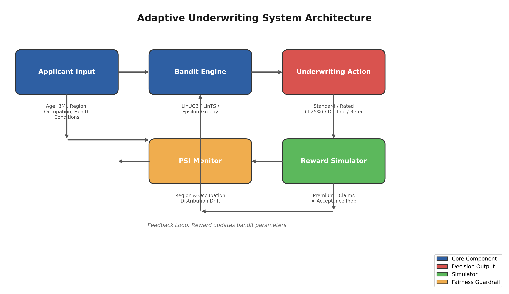
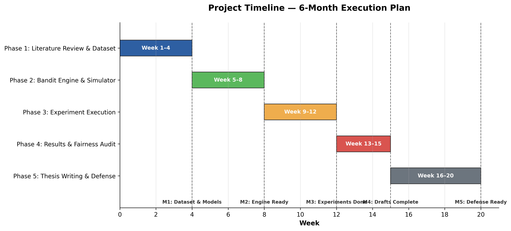

# CHAPTER II. PRESENTATION OF THE PROJECT

---

## 2.1 General Presentation of Project

This project develops an adaptive health insurance underwriting system designed specifically for the Cambodian market. The system is titled *"Adaptive Health Insurance Underwriting via Contextual Bandits: A Reinforcement Learning Approach for Cambodia."* It addresses the critical problem that traditional static rule-based underwriting is suboptimal for emerging-market health insurance because it ignores feature interactions and cannot adapt to portfolio drift over time.

The Cambodian health insurance market presents a unique operating environment. Insurance penetration remains below two percent of the population, distribution relies heavily on agent networks with commissions consuming fifteen to thirty percent of premium revenue, and underwriting decisions are made using deterministic rule sets that cannot learn from experience. Mobile penetration, however, exceeds one hundred percent of the population, and digital payment platforms have reached approximately eighty percent of Cambodian adults. This divergence — low insurance penetration alongside high mobile connectivity — creates an opportunity for algorithmic underwriting delivered through mobile channels.

The project produces four principal deliverables:

1. **Synthetic Cambodia Health Insurance Dataset.** A reproducible dataset of 2,000 applicants anchored on the Cambodia Demographic and Health Survey (CDHS) 2021–22 conducted by the National Institute of Statistics (NIS) in partnership with ICF. The dataset reproduces realistic demographics, disease prevalence (tuberculosis, hepatitis B), regional variation across Cambodian provinces, and occupational risk profiles calibrated to local labor market conditions. The generation script is fully parameterized, enabling other researchers to regenerate or extend the data.

2. **Contextual Bandit Underwriting Engine.** Implementations of three contextual bandit algorithms — LinUCB (Li et al., 2010), LinTS (Agrawal & Goyal, 2013), and Epsilon-Greedy — that learn optimal accept, rate, decline, and refer decisions from sequential feedback. The engine is designed to operate with sub-200-millisecond decision latency on standard CPU hardware, making it deployable on low-resource mobile infrastructure.

3. **Actuarial Reward Simulator.** A profit-based simulator that computes expected reward for each underwriting action, incorporating premium levels calibrated to Cambodian income distributions, claims costs modeled from regional disease burden data, adverse selection effects, and customer acceptance probability as a function of premium-to-income ratio.

4. **Fairness Monitoring Framework.** Population Stability Index (PSI) guardrails that continuously compare the demographic distribution of the approved portfolio against the applicant population. The framework raises GREEN, AMBER, or RED alerts when regional or occupational distributions diverge beyond actuarial thresholds, ensuring that algorithmic profitability does not come at the cost of demographic exclusion.

The project is evaluated through three controlled experiments:

- **EXP-005: Underwriting Convergence.** Validates that LinUCB learns risk-appropriate decisions and outperforms a static XGBoost rule baseline on cumulative reward and average regret.
- **EXP-006: Fairness Audit.** Verifies that no regional or occupational segment experiences an approval rate below fifty percent of the maximum observed rate, and that PSI remains within GREEN thresholds.
- **EXP-007: Benchmark Comparison.** Provides a head-to-head comparison of LinUCB, LinTS, Epsilon-Greedy, and Static XGB on cumulative regret over 5,000 decision rounds.

All experiments are self-contained Python scripts with fixed random seeds, pass/fail assertions, and standardized exit codes suitable for continuous integration.

---

## 2.2 Problematic

Current health insurance underwriting in Cambodia relies on static rule engines or pre-trained classification models that apply the same decision boundary to every applicant, regardless of how the applicant population evolves. This creates three distinct problems that the project is designed to solve.

### Suboptimal Risk Selection

Static rules ignore feature interactions. A rule that declines all applicants with BMI above thirty and age above fifty cannot learn that a fit, non-smoking fifty-five-year-old with BMI thirty-one may be a profitable standard-risk case. Similarly, a rule that rates all rural applicants equally cannot distinguish between a low-risk rural civil servant and a high-risk rural construction worker. The result is a portfolio that systematically excludes profitable applicants while underpricing genuinely elevated risks. This suboptimal selection reduces both insurer profitability and market coverage.

### Inability to Adapt to Portfolio Drift

As the insured population changes — through economic growth, urbanization, occupational shifts, or public health interventions — the risk distribution of incoming applicants drifts away from the population on which the static model was trained. A model trained in 2023 may face a 2026 applicant pool with substantially different age, occupation, and disease prevalence profiles. Without online learning, the model cannot adapt its decision boundaries to maintain profitability. The project addresses this by framing underwriting as a sequential learning problem in which the algorithm improves continuously from each new applicant.

### Fairness and Demographic Parity

Static models optimized for aggregate accuracy can inadvertently discriminate against demographic segments. If the training data underrepresents rural applicants or garment workers, the model may learn to decline these segments at higher rates. In Cambodia, where garment workers number approximately 700,000 (85 percent women) and rural rice farmers number approximately 2.5 million, such discrimination would both deepen social inequality and exclude large addressable markets. The project embeds PSI-based fairness guardrails directly into the underwriting pipeline to detect and flag demographic drift before it becomes entrenched.

These three problems share a common structural cause: the underwriting system treats decision-making as a one-shot prediction task rather than a sequential learning problem. Contextual bandits reframe the task as an online optimization problem in which the algorithm explicitly balances exploration (testing uncertain applicants to learn) with exploitation (applying known good decisions), while monitoring demographic parity through PSI guardrails.

---

## 2.3 Objective

### Primary Objective

To design, implement, and empirically validate a contextual bandit framework for health insurance underwriting that outperforms static rule-based baselines on cumulative profitability while maintaining regional and occupational fairness on a synthetic Cambodia dataset.

### Secondary Objectives

1. **Dataset Development.** Develop a reproducible synthetic dataset of 2,000 Cambodian health insurance applicants anchored on the Cambodia Demographic and Health Survey (CDHS) 2021–22 (NIS/ICF). The dataset shall reproduce realistic demographics, disease prevalence (including tuberculosis and hepatitis B), regional variation, and occupational risk profiles.

2. **Algorithm Implementation and Comparison.** Implement and compare three contextual bandit algorithms — LinUCB, LinTS, and Epsilon-Greedy — against a static XGBoost rule baseline on cumulative reward and regret metrics over 5,000 decision rounds.

3. **Fairness Guardrail Design.** Design and validate PSI-based fairness guardrails that ensure the approved portfolio does not drift demographically from the applicant population.

4. **Fairness Audit.** Conduct a fairness audit verifying that no regional or occupational segment experiences an approval rate below fifty percent of the maximum observed rate.

### Research Questions

- **RQ1.** Do contextual bandits (LinUCB, LinTS) achieve higher cumulative reward and lower cumulative regret than static XGBoost rule baselines on the Cambodia health underwriting task?

- **RQ2.** Does the bandit framework maintain demographic fairness — as measured by regional and occupational approval-rate parity and PSI — without explicit fairness constraints in the reward function?

- **RQ3.** What is the relative performance ranking of LinTS, LinUCB, Epsilon-Greedy, and Static XGB on regret and reward, and what algorithmic properties explain the ordering?

- **RQ4.** Is the proposed framework technically feasible for deployment on low-resource mobile infrastructure, and what implementation pathway is required?

---

## 2.4 Planning of Project

The project was executed according to the following schedule:

[TABLE: Project timeline with phases, activities, duration, and milestones]

| Phase | Activities | Duration | Timeline |
|-------|-----------|----------|----------|
| Phase 1 | Literature review, dataset design, baseline model training | 4 weeks | Month 1 |
| Phase 2 | Bandit algorithm implementation, reward simulator development | 4 weeks | Month 2 |
| Phase 3 | Experiment execution (EXP-005, EXP-006, EXP-007) | 4 weeks | Month 3 |
| Phase 4 | Results analysis, fairness audit, figure generation | 3 weeks | Month 4 |
| Phase 5 | Thesis writing, presentation preparation, defense rehearsal | 5 weeks | Month 5–6 |

Key milestones:

- **Milestone 1:** Dataset and baseline models complete (end of Month 1)
- **Milestone 2:** Bandit engine and reward simulator operational (end of Month 2)
- **Milestone 3:** All three experiments executed with passing results (end of Month 3)
- **Milestone 4:** Figures, tables, and draft chapters complete (end of Month 4)
- **Milestone 5:** Final thesis submission and defense readiness (end of Month 6)

---

*Formatting: Chapter heading II — Size 16 Bold ALL CAPS new page. Sections 2.1–2.4 — Size 14 Bold. Subsections — Size 12 Bold indent once. Body — Size 12, 1.5 spacing, justified.*
